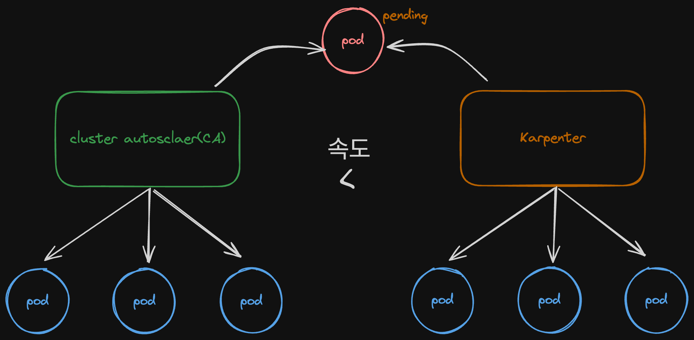

# CH02_03. 시나리오 설명 및 실습
> **주의사항**
terraform으로 프로비저닝된 리소스 및 서비스들은 시나리오 종료시마다 반드시 `terraform destroy` 명령어를 사용하여 정리해주세요. 그렇지 않으면, 불필요한 비용이 많이 발생할 수 있습니다. AWS 비용 측정은 시간당으로 계산되기에 매번 리소스를 생성하고 삭제하는 것이 불편하실 수도 있겠지만, 비용을 절감시키기 위해서 권장드립니다. 본인의 상황에 맞게 진행해주세요.

<br>

## 챕터명
---
노드의 예약 대기 시간과 인프라 비용을 줄이기 위해 karpenter 사용

<br><br>

## 내용
---
서비스를 운영하다 보면, 트래픽에 유연하게 대응하기 위해서 애플리케이션의 수를 증가시킬 필요가 있습니다.
이 때, 우리는 EKS 상에서 서비스 되고 있는 파드의 수를 수동적이든, `HPA`를 사용하여 자동적이든 증가시키는데 성공합니다.  

다만, 해당 특정 파드들이 `pending` 상태로 머무르게 되어 증가하는 트래픽에 대응하지 못해 장애가 발생합니다.
이러한 현상이 일어나는 이유는 파드는 정상적으로 증가하려고 하지만, 그에 맞춰서 노드(EC2)가 함께 증가되지 못했기 때문입니다.  

그렇다면, 이러한 이슈를 해결하기 위해서는 무엇이 필요할까요? Node를 자동적으로 `스케일 인<->아웃`하는 오토 스케일러가 필요합니다. 이 스케일러에는 `cluster autosclaer(CA)`와 `karpenter`가 존재합니다. 이 두 스케일러를 기반으로 시나리오를 진행하며, 왜 karpenter가 CA에 비해서 각광을 받는지 살펴봅니다.



<br><br>

## 환경
---
Terraform
AWS: EKS
Cluster Autoscaler
Karpenter
Sample pause pod

<br><br>

## 시나리오
---
1. 환경구축
2. `ClusterAutoscaler(CA)`가 없을 때, pending 현상 발생시킴(replica -> 5)
3. `ClusterAutoscaler` 생성 후, 노드 프로비저닝 속도와 실제 애플리케이션 동작하는 타임라인 확인
4. `Karpenter` 생성 후, 노드 프로비저닝 속도와 실제 애플리케이션 동작하는 타임라인 확인

<br><br>

## 주요명령어
---
```bash
k9s                               # 쿠버네티스 환경과 상호작용 하기 위한 GUI

terraform init                    # 테라폼 모듈 다운로드 및 초기화 작업 진행
terraform plan                    # 테라폼으로 파일에 명시된 리소스들을 프로비저닝 하기 전 확인단계
terraform apply                   # 테라폼으로 파일에 명시된 리소스들을 프로비저닝
terraform destroy                 # 테라폼으로 파일에 명시된 리소스들을 삭제함

kubectl config current-context    # 현재 나의 로컬환경에 연결되어 있는 클러스터 확인
kubectl apply -f {파일명}           # yaml 파일에 기재된 쿠버네티스 리소스들을 생성
kubectl delete -f {파일명}          # yaml 파일에 기재된 쿠버네티스 리소스들을 삭제
```