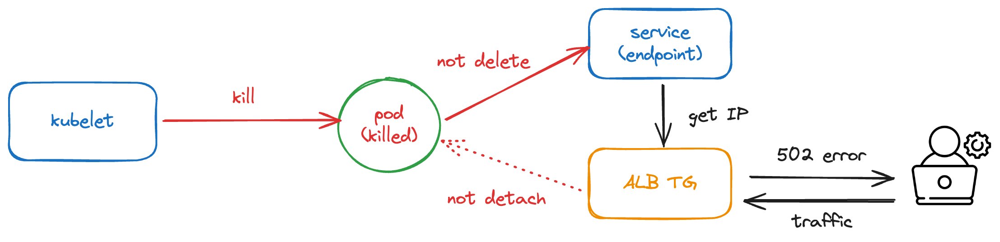
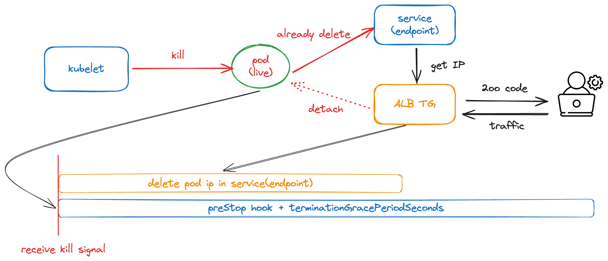

# CH03_03. 시나리오 설명 및 실습
> **주의사항**
terraform으로 프로비저닝된 리소스 및 서비스들은 시나리오 종료시마다 반드시 `terraform destroy` 명령어를 사용하여 정리해주세요. 그렇지 않으면, 불필요한 비용이 많이 발생할 수 있습니다. AWS 비용 측정은 시간당으로 계산되기에 매번 리소스를 생성하고 삭제하는 것이 불편하실 수도 있겠지만, 비용을 절감시키기 위해서 권장드립니다. 본인의 상황에 맞게 진행해주세요.

<br>

## 챕터명

서비스의 안정성을 높이는 안정적인 종료를 위한 시나리오 실습

<br><br>

## 내용

서비스를 운영하다 보면, 트래픽이 많을 때 배포를 진행하는 경우도 있고, 여러 최적화 서비스로 인해서 파드가 `스케일 인`이 진행되는 경우도 있습니다. 이 때, 파드가 트래픽을 처리하고 있는 도중 종료되면 사용자에게 치명적인 오류를 경험하게 할 수 있습니다. 예를 들어, `502 Bad gateway`와 같은 현상입니다.

이러한 현상이 발생하는 이유는, 위에 상황에서 말씀 드렸다시피 트래픽을 온전히 처리하지 못하고, 파드가 급하게 종료되서 발생하는 이슈입니다. 더 깊이 살펴보면은 두 가지 원인이 있습니다.

하나는, 파드가 정상적으로 종료되었지만, `k8s service` 및 `ALB의 Target Group`에는 아직 detach 되지 못했기 때문에 트래픽이 종료된 파드로 유입되서 발생하는 것입니다.
또 하나는, 파드가 마지막으로 유입된 트래픽을 충분히 처리할 시간이 주어지지 않았다는 것입니다.

이 두가지 원인을 해결하기 위해서는 `preStop hook`과 `terminationGracePeriodSeconds`을 이용하여 파드 내부의 애플리케이션이 Graceful하게 종료되도록 하는 것입니다.

이번 실습에서는 이러한 이슈를 발생시켜 보고, 실제로 위 방법을 사용하여 해결해 보도록 하겠습니다.


**[그림1. ALB TG에서 pod의 IP가 제거되기 전에 파드가 종료되었을 때, 유저가 접근하는 케이스]**

<br>


**[그림2. 파드가 종료되기 전, ALB TG에서 pod의 IP가 먼저 제거되었을 때 유저가 접근하는 케이스]**

<br><br>

## 환경

- Terraform
- AWS: EKS
- Karpenter
- Sample application
- Vegeta

<br><br>

## 시나리오

1. 스트레스 테스트 도중 샘플 앱 재시작 후, 500번대 에러 확인
2. preStop hook 생성 및 terminationGracePeriodSeconds 값 조정
3. 스트레스 테스트 도중 샘플 앱 재시작 후, 500번대 에러 확인

<br><br>

## 주요명령어

```bash
k9s                               # 쿠버네티스 환경과 상호작용 하기 위한 GUI

terraform init                    # 테라폼 모듈 다운로드 및 초기화 작업 진행
terraform plan                    # 테라폼으로 파일에 명시된 리소스들을 프로비저닝 하기 전 확인단계
terraform apply                   # 테라폼으로 파일에 명시된 리소스들을 프로비저닝
terraform destroy                 # 테라폼으로 파일에 명시된 리소스들을 삭제함

kubectl config current-context    # 현재 나의 로컬환경에 연결되어 있는 클러스터 확인
kubectl apply -f {파일명}           # yaml 파일에 기재된 쿠버네티스 리소스들을 생성
kubectl delete -f {파일명}          # yaml 파일에 기재된 쿠버네티스 리소스들을 삭제

echo "GET {NGINX_로드밸런서_엔드포인트}" | vegeta attack -duration=240s -rate=100 | vegeta report    # 스트레스 테스트를 진행
```