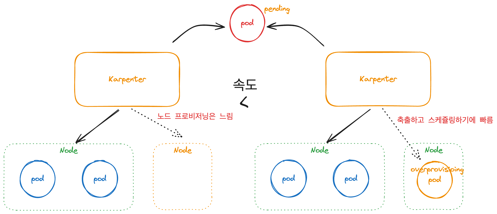

# CH04_03. 시나리오 설명 및 실습
> **주의사항**
terraform으로 프로비저닝된 리소스 및 서비스들은 시나리오 종료시마다 반드시 `terraform destroy` 명령어를 사용하여 정리해주세요. 그렇지 않으면, 불필요한 비용이 많이 발생할 수 있습니다. AWS 비용 측정은 시간당으로 계산되기에 매번 리소스를 생성하고 삭제하는 것이 불편하실 수도 있겠지만, 비용을 절감시키기 위해서 권장드립니다. 본인의 상황에 맞게 진행해주세요.

<br>

## 챕터명

치솟는 트래픽에 유연하게 대응하기 위해서 오버프로비저닝 적용

<br><br>

## 내용

트래픽이 많이 치솟을 때, 파드는 `HPA`를 이용해서, 노드는 `Karpenter`를 이용해서 스케일 아웃을 능동적으로 진행하여 어느 정도 대응이 가능합니다. 하지만, 예측 가능한 범위를 초과하여 인입하는 트래픽에 대해서는 역시나 노드의 웜업시간 때문에 장애가 발생할 수 있습니다.

이 때, 다른 파드에 의해 축출될 수 있도록 우선순위가 낮은 `오버프로비저닝 파드`를 배포하여 노드를 미리 웜업시키는 전략을 채택하여 기존보다 더 많은 트래픽을 유연하게 대응할 수 있습니다. 다만, 과도한 오버프로비저닝 파드의 사용은 비용을 높일 수 있으므로 상황에 맞게 사용해야 합니다.

우리는 이 실습에서 `HPA`와 `Karpenter`가 적용되어 있는 환경에 CPU 사용률이 높은 샘플 앱을 배포하여 오버프로비저닝이 없을 때와 있을 때의 스케쥴링 속도에 대한 차이를 비교해 봅니다.


**[그림1. 오버프로비저닝을 사용하여 빠르게 파드를 스케쥴링]**

<br><br>

## 환경

Terraform
AWS: EKS
Karpenter
Metric Server
Sample application
Overprovisioning pod

<br><br>

## 시나리오

1. CPU 사용률이 높은 샘플 앱 배포 후, `pending` 상태의 스케쥴링 속도 체크
2. 오버프로비저닝 파드 배포
3. CPU 사용률이 높은 샘플 앱 repica 수 조정하여 `pending` 상태의 스케쥴링 속도 체크

<br><br>

## 주요명령어

```bash
k9s                               # 쿠버네티스 환경과 상호작용 하기 위한 GUI

terraform init                    # 테라폼 모듈 다운로드 및 초기화 작업 진행
terraform plan                    # 테라폼으로 파일에 명시된 리소스들을 프로비저닝 하기 전 확인단계
terraform apply                   # 테라폼으로 파일에 명시된 리소스들을 프로비저닝
terraform destroy                 # 테라폼으로 파일에 명시된 리소스들을 삭제함

kubectl config current-context    # 현재 나의 로컬환경에 연결되어 있는 클러스터 확인
kubectl apply -f {파일명}           # yaml 파일에 기재된 쿠버네티스 리소스들을 생성
kubectl delete -f {파일명}          # yaml 파일에 기재된 쿠버네티스 리소스들을 삭제
```