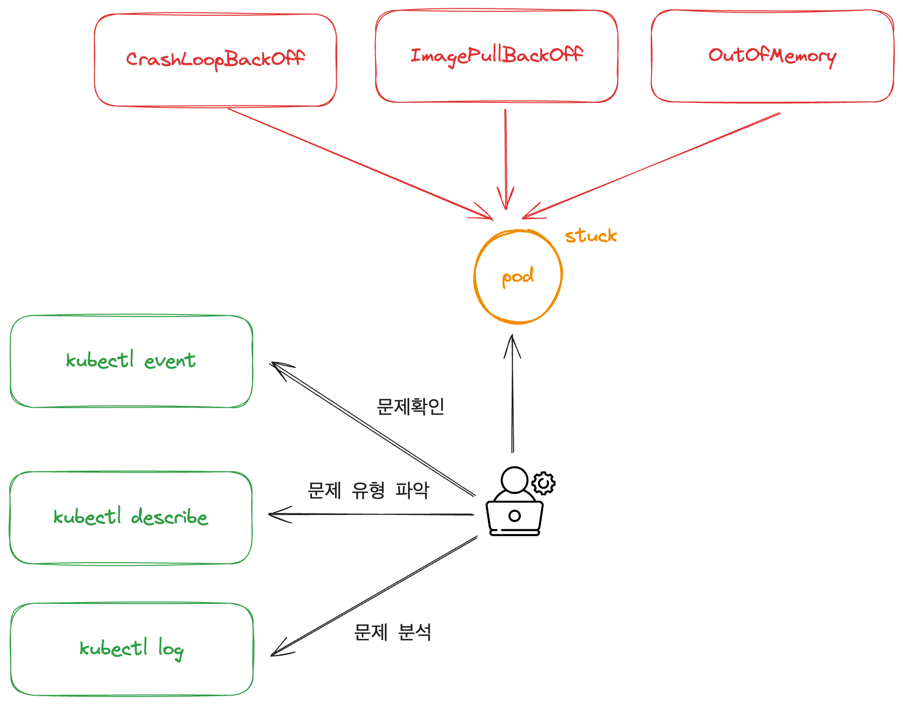

# CH05_03. 시나리오 설명 및 실습
> **주의사항**
terraform으로 프로비저닝된 리소스 및 서비스들은 시나리오 종료시마다 반드시 `terraform destroy` 명령어를 사용하여 정리해주세요. 그렇지 않으면, 불필요한 비용이 많이 발생할 수 있습니다. AWS 비용 측정은 시간당으로 계산되기에 매번 리소스를 생성하고 삭제하는 것이 불편하실 수도 있겠지만, 비용을 절감시키기 위해서 권장드립니다. 본인의 상황에 맞게 진행해주세요.

<br>

## 챕터명

리소스 별 에러메시지 유형 해결

<br><br>

## 내용

쿠버네티스 환경에서 서비스를 운영하다 보면, 다양한 에러가 발생합니다. 이 때, 에러가 발생하면 어떻게 파악하고 어떻게 해석하여 해결하는지에 대해서 알아보도록 합니다.  

실습에서는 파드를 비정상 상태로 만들고, 해당 에러를 파악하여 올바르게 해결해 보는 시간을 가집니다.

**[그림1. 문제가 일어난 파드를 확인하고 분석하는 과정]**

<br><br>

## 환경

- Terraform
- EKS
- Karpenter
- Sample application

<br><br>

## 시나리오

1. 문제 발생
2. 해당 에러메시지 확인
3. 문제 해결

<br><br>

## 에러 유형

1. **CrashLoopBackOff**: 이는 컨테이너가 실행되고 즉시 종료되거나 실패하여 계속해서 재시작되는 상황을 나타냅니다.
2. **ImagePullBackOff**: 컨테이너가 이미지를 가져오지 못했거나 구동할 수 없는 상황을 나타냅니다.
3. **OutOfMemory**: 메모리 부족으로 인한 컨테이너 실패입니다.
4. **Evicted**: 파드가 노드에서 제거되었거나, 스케줄링을 위해 노드에서 삭제된 경우입니다.

<br><br>

## 주요명령어

```bash
k9s                               # 쿠버네티스 환경과 상호작용 하기 위한 GUI

terraform init                    # 테라폼 모듈 다운로드 및 초기화 작업 진행
terraform plan                    # 테라폼으로 파일에 명시된 리소스들을 프로비저닝 하기 전 확인단계
terraform apply                   # 테라폼으로 파일에 명시된 리소스들을 프로비저닝
terraform destroy                 # 테라폼으로 파일에 명시된 리소스들을 삭제함

kubectl config current-context    # 현재 나의 로컬환경에 연결되어 있는 클러스터 확인
kubectl apply -f {파일명}           # yaml 파일에 기재된 쿠버네티스 리소스들을 생성
kubectl delete -f {파일명}          # yaml 파일에 기재된 쿠버네티스 리소스들을 삭제
```

<br><br>

## 실제 실습 명령어

```bash
# 0. 실습 환경 구축
terraform -chdir=../ plan 
terraform -chdir=../ apply --auto-approve

# 1. 각 실습에 필요한 파드 배포 및 삭제
kubectl apply -f 01-CrashLoopBackOff.yaml
kubectl delete -f 01-CrashLoopBackOff.yaml

kubectl apply -f 02-ImagePullBackOff.yaml
kubectl delete -f 02-ImagePullBackOff.yaml

kubectl apply -f 03-OOM.yaml
kubectl delete -f 03-OOM.yaml

kubectl apply -f 04-Evicted.yaml
kubectl delete -f 04-Evicted.yaml

# 2. 실습 환경 제거
terraform -chdir=../ destroy --auto-approve
```

<br><br>

## 파일 설명
|파일명|설명|
|---|---|
|01-CrashLoopBackOff.yaml|CrashLoopBackOff 발생시키는 메니페스트|
|02-ImagePullBackOff.yaml|ImagePullBackOff 발생시키는 메니페스트|
|03-OOM.yaml|Out of Memory를 발생시키는 메니페스트|
|04-Evicted.yaml|파드를 축출하는 실습을 진행하기 위한 메니페스트|

<br><br>

## 참고
- [애플리케이션 트러블슈팅하기](https://kubernetes.io/ko/docs/tasks/debug/debug-application/)