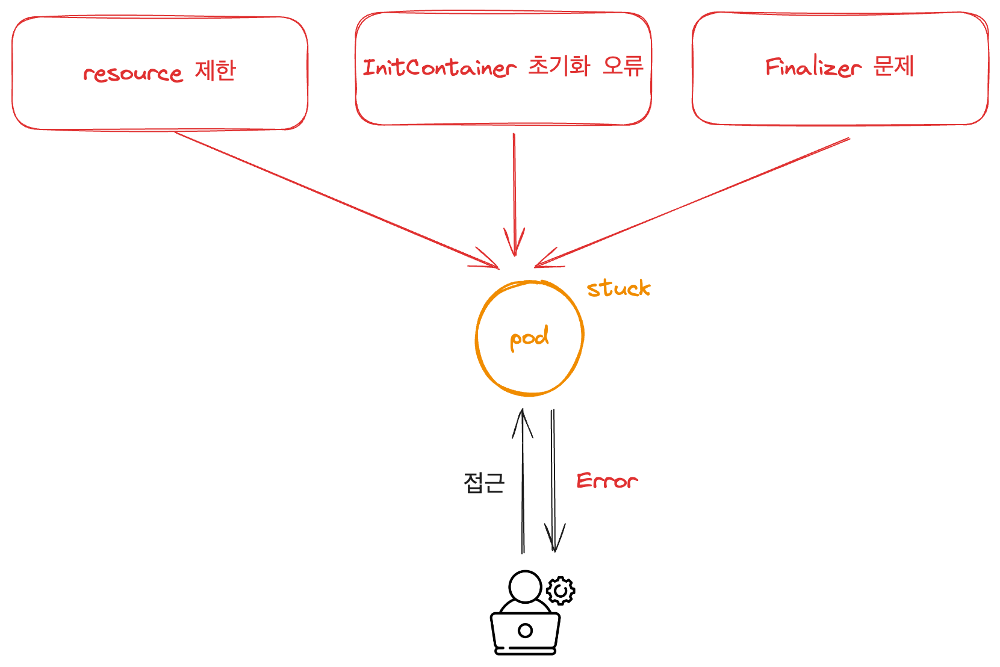

# CH06_03. 시나리오 설명 및 실습
> **주의사항**
terraform으로 프로비저닝된 리소스 및 서비스들은 시나리오 종료시마다 반드시 `terraform destroy` 명령어를 사용하여 정리해주세요. 그렇지 않으면, 불필요한 비용이 많이 발생할 수 있습니다. AWS 비용 측정은 시간당으로 계산되기에 매번 리소스를 생성하고 삭제하는 것이 불편하실 수도 있겠지만, 비용을 절감시키기 위해서 권장드립니다. 본인의 상황에 맞게 진행해주세요.

<br>

## 챕터명

삭제가 되지 않는 Stuck 상태인 리소스를 해결해보자.

<br><br>

## 내용

쿠버네티스 상에서는 다양한 이유로 파드가 `stuck` 상태로 머무를 수 있습니다. 이는 예기치 못한 서비스의 장애를 일으키기 때문에 확인되면 빠르게 해당 리소스를 정리해 주어야 합니다.

이번 실습에서는 `Stuck` 상태를 재현해 보고, 해당 상태를 해결해보도록 합니다.


**[그림1. 파드의 stuck 상태를 일으키는 다양한 원인]**

<br><br>

## 환경

- Terraform
- AWS: EKS
- Karpenter
- Sample application

<br><br>

## 시니라오

1. Stuck 발생
2. Stuck 해결

<br><br>

## Stuck 유형

1. **ResourceQuotaMemory**: 네임스페이스의 메모리 허용치를 설정하여 그 이상 설정된 파드가 배포되지 못하고 stuck 상태로 남아 있도록 합니다.
2. **ResourceQuotaCPU**: 네임스페이스의 메모리 허용치를 설정하여 그 이상 설정된 파드가 배포되지 못하고 stuck 상태로 남아 있도록 합니다.
3. **InitContainerIssue**: initContainer에 문제를 일으켜 메인 컨테이너를 stuck 상태로 만들어 봅니다.
4. **FinalizerIssue**: finalizer의 오동작으로 삭제가 되지않은 stuck 상태로 만들어 봅니다.

<br><br>

## 주요명령어

```bash
k9s                               # 쿠버네티스 환경과 상호작용 하기 위한 GUI

terraform init                    # 테라폼 모듈 다운로드 및 초기화 작업 진행
terraform plan                    # 테라폼으로 파일에 명시된 리소스들을 프로비저닝 하기 전 확인단계
terraform apply                   # 테라폼으로 파일에 명시된 리소스들을 프로비저닝
terraform destroy                 # 테라폼으로 파일에 명시된 리소스들을 삭제함

kubectl config current-context    # 현재 나의 로컬환경에 연결되어 있는 클러스터 확인
kubectl apply -f {파일명}           # yaml 파일에 기재된 쿠버네티스 리소스들을 생성
kubectl delete -f {파일명}          # yaml 파일에 기재된 쿠버네티스 리소스들을 삭제
```