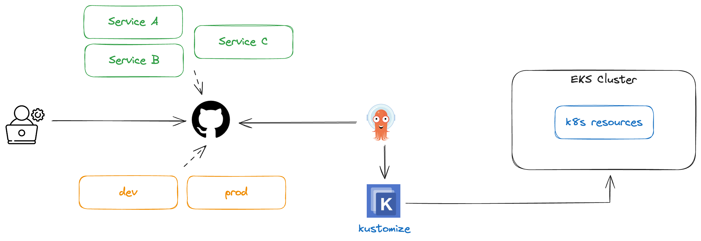
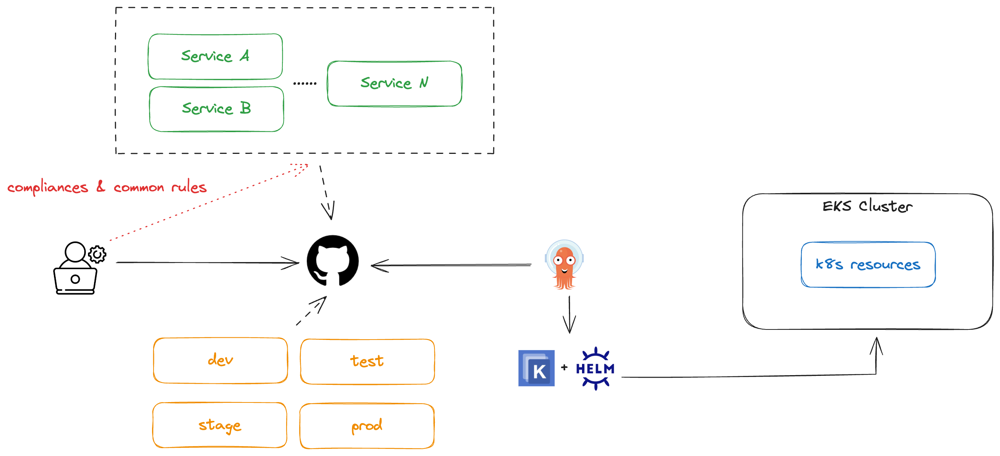

# Part CH07_03. 상황별 적합한 솔루션을 선택해보자
> **주의사항**
terraform으로 프로비저닝된 리소스 및 서비스들은 시나리오 종료시마다 반드시 `terraform destroy` 명령어를 사용하여 정리해주세요. 그렇지 않으면, 불필요한 비용이 많이 발생할 수 있습니다. AWS 비용 측정은 시간당으로 계산되기에 매번 리소스를 생성하고 삭제하는 것이 불편하실 수도 있겠지만, 비용을 절감시키기 위해서 권장드립니다. 본인의 상황에 맞게 진행해주세요.

<br>

## 챕터명

kustomize, helm, kustomize + helm은 언제 사용해야 하는가?

<br><br>

## 내용

동일한 서비스가 회사마다 또는 팀마다 운영하는 방식이 상이할 수 있습니다. 예를 들어, 어떤 회사에서는 devops 엔지니어가 모든 서비스의 GitOps 레포지토리를 관리할 수 있고, 또 어떤 회사에서는 서비스 별로 팀이 구성되어 있으며, 해당 개발자들이 GitOps 레포지토리를 관리하거나 운영할 수 있습니다.

그리고, 마이크로 서비스 아키텍쳐를 잘 준수하여 그에 맞게 팀이 구성되어 있는 기업일 경우, 더욱 더 세밀한 관리가 필요할 수 있습니다.

이에 서비스의 규모 및 형태에 따라 GitOps 메티페스트를 관리하는 적절한 솔수션을 채택해 봅시다.

<br>


**[그림1. 서비스 규모가 작은 기업에서 데브옵스가 GitOps 레포지토리를 전적으로 관리할 때, kustomize를 사용]**

<br>


**[그림2. 모든 서비스에 일괄적으로 컴플라이언스 및 공통 규칙을 적용할 필요가 있을 때, helm를 사용]**

<br>


**[그림3. 각 서비스를 구성하는 k8s 리소스들이 어느 정도 정해져 있을 때, helm 사용]**

<br>


**[그림4. 모든 서비스에 일괄적으로 컴플라이언스 및 공통 규칙을 적용하고, 커스텀을 쉽게 진행하기 위해서, kustomize와 helm을 사용]**

<br>

위와 같이 다양한 상황을 기반으로 적절한 솔루션을 선택할 수 있습니다. 본인이 속해있는 기업, 팀 또는 서비스의 구성 형태에 따라서 적합한 솔루션을 선택하는 것을 권장합니다.

<br><br>

## 환경

- Terraform
- EKS
- Karpenter
- kustomize
- helm
- Sample app

<br><br>

## 시나리오

1. 규모가 작은 기업에서 데브옵스 엔지니어가 모든 서비스의 GitOps를 관리할 경우, `kustomize`를 사용하자.
2. 모든 서비스에 일괄적으로 컴플라이언스 및 공통 규칙을 적용할 필요가 있거나, 팀 별로 각 서비스를 구성하는 k8s 리소스들이 어느 정도 정해져 있으면 `Helm`으로 통합 관리하자.
3. 모든 서비스에 일괄적으로 컴플라이언스 및 공통 규칙을 적용하고, 커스텀을 쉽게 진행하기 위해서, `kustomize + helm`를 사용하자.

<br><br>

## 주요명령어

```bash
terraform init                    # 테라폼 모듈 다운로드 및 초기화 작업 진행
terraform plan                    # 테라폼으로 파일에 명시된 리소스들을 프로비저닝 하기 전 확인단계
terraform apply                   # 테라폼으로 파일에 명시된 리소스들을 프로비저닝
terraform destroy                 # 테라폼으로 파일에 명시된 리소스들을 삭제함

kustomize build {kustomization.yaml 파일이 있는 경로}                         # 커스텀이 적용된 yaml파일을 만듬
kustomize build {kustomization.yaml 파일이 있는 경로} | kubectl apply -f -    # 커스텀이 적용된 yaml파일을 만들어 클러스터에 배포
kustomize build {kustomization.yaml 파일이 있는 경로} | kubectl delete -f -   # 클러스터에 배포된 k8s 리소스들을 모두 삭제

helm dependency build                  # Chart.yaml 의 내용에 따라 charts/ 업데이트
helm template {helm 파일들이 있는 경로}    # 로컬에서 템플릿을 렌더링
helm template {helm 파일들이 있는 경로} | kubectl apply -f -     # 로컬에서 템플릿을 렌더링 후, 클러스터에 배포
helm template {helm 파일들이 있는 경로} | kubectl delete -f -    # 클러스터에 배포된 k8s 리소스들을 모두 삭제

kustomize build . --enable-helm        # kustomize를 사용하여 helm 템플릿을 렌더링 한 후, 커스텀이 적용된 yaml파일을 만듬
kustomize build . --enable-helm | kubectl apply -f -     # kustomize를 사용하여 helm 템플릿을 렌더링 한 후, 커스텀이 적용된 yaml파일을 기반으로 클러스터에 배포
kustomize build . --enable-helm | kubectl delete -f -    # 클러스터에 배포된 k8s 리소스들을 모두 삭제
```

<br><br>

## 실제 실습 명령어

```bash
# 0. 실습 환경 구축
terraform -chdir=../ plan 
terraform -chdir=../ apply --auto-approve

# 1-1. kustomize로 dev 환경의 서비스 배포 및 삭제
kustomize build ./01-kustomize/dev | kubectl apply -f -
kustomize build ./01-kustomize/dev | kubectl delete -f -

# 1-2. kustomize로 prod 환경의 서비스 배포 및 삭제
kustomize build ./01-kustomize/prod | kubectl apply -f -
kustomize build ./01-kustomize/prod | kubectl delete -f -

# 2. 헬름으로 서비스 배포 및 삭제
helm template demo ./02-helm
helm install demo ./02-helm
helm delete demo

# 3-1. kustomize+helm으로 dev 환경의 서비스 배포 및 삭제
kustomize build ./03-kustomize+helm/dev --enable-helm | kubectl apply -f -
kustomize build ./03-kustomize+helm/dev --enable-helm | kubectl delete -f -

# 3-2. kustomize+helm으로 prod 환경의 서비스 배포 및 삭제
kustomize build ./03-kustomize+helm/prod --enable-helm | kubectl apply -f -
kustomize build ./03-kustomize+helm/prod --enable-helm | kubectl delete -f -

# 4. 실습 환경 제거
terraform -chdir=../ destroy --auto-approve
```

<br><br>

## 파일 설명
|디렉토리명|설명|
|---|---|
|01-kustomize|kustomize로 k8s 리소스를 배포하기 위한 디렉토리|
|02-helm|helm으로 k8s 리소스를 배포하기 위한 디렉토리|
|03-kustomize+helm|kustomize와 helm을 사용하여 k8s 리소스를 배포하기 위한 디렉토리|

<br><br>

## 참고
- [kustomize](https://kustomize.io/)
- [helm](https://helm.sh/)
- [argocd-examples-apps](https://github.com/kmaster8/argocd-example-apps)
- [kustomization of a helm chart](https://github.com/kubernetes-sigs/kustomize/blob/master/examples/chart.md#kustomization-of-a-helm-chart)