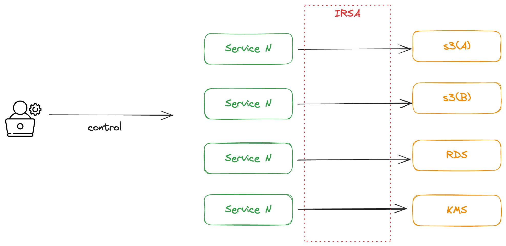
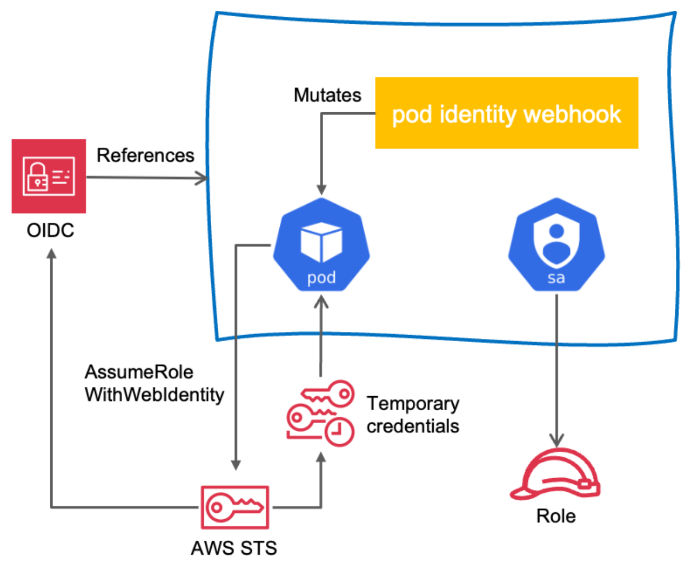

# Part CH08_03. 시나리오 설명 및 실습
> **주의사항**
terraform으로 프로비저닝된 리소스 및 서비스들은 시나리오 종료시마다 반드시 `terraform destroy` 명령어를 사용하여 정리해주세요. 그렇지 않으면, 불필요한 비용이 많이 발생할 수 있습니다. AWS 비용 측정은 시간당으로 계산되기에 매번 리소스를 생성하고 삭제하는 것이 불편하실 수도 있겠지만, 비용을 절감시키기 위해서 권장드립니다. 본인의 상황에 맞게 진행해주세요.

<br>

## 챕터명

특정 애플리케이션에만 특정 권한을 세팅하기 위한 IRSA 적용

<br><br>

## 내용

서비스를 운영하다 보면은 보안성을 높이기 위해 권한을 세밀하게 통제해야 할 필요성이 있습니다. 

예를 들어, 서비스 A와 서비스 B가 있을 때, 각 서비스에 접근하는 AWS의 리소스와 서비스가 달라야 합니다. 하지만 대부분 서비스 별로 권한을 통제하기 보다는 모든 서비스를 공통 권한에 묶어 처리하는 경우가 많습니다. 

물론 서비스의 구성 형태가 동일하고 접근하는 리소스가 같다는 전제에서는 해당 프로세스가 적합할 수도 있지만, 기업의 규모가 커지면 커질 수록 다양한 리소스에 각기 다른 목적으로 접근해야 하는 경우가 있습니다. 이 때, 서비스별로 권한을 통제하기 위해서는 여러가지 방법이 있지만 여기에서는 `IRSA`를 기반으로 진행해 보고, IRSA를 더욱 쉽게 구성하고 관리할 수 있는 요즘 트렌드인 `pod identity`를 이용하는 방법을 추가적으로 알아봅니다.

<br>


**[그림1. IRSA의 추상적인 적용 범위]**

<br>


**[그림2. IRSA의 메카니즘]**

<br><br>

## 환경

- Terraform
- EKS
- Karpenter
- Sample application

<br><br>

## 시나리오

1. 규모가 작은 기업에서 데브옵스 엔지니어가 모든 서비스의 GitOps를 관리할 경우, `kustomize`를 사용하자.
2. 모든 서비스에 일괄적으로 컴플라이언스 및 공통 규칙을 적용할 필요가 있거나, 팀 별로 각 서비스를 구성하는 k8s 리소스들이 어느 정도 정해져 있으면 `Helm`으로 통합 관리하자.
3. 모든 서비스에 일괄적으로 컴플라이언스 및 공통 규칙을 적용하고, 커스텀을 쉽게 진행하기 위해서, `helm + kustomize`를 사용하자.

<br><br>

## 주요명령어

```bash
terraform init                    # 테라폼 모듈 다운로드 및 초기화 작업 진행
terraform plan                    # 테라폼으로 파일에 명시된 리소스들을 프로비저닝 하기 전 확인단계
terraform apply                   # 테라폼으로 파일에 명시된 리소스들을 프로비저닝
terraform destroy                 # 테라폼으로 파일에 명시된 리소스들을 삭제함

kubectl config current-context    # 현재 나의 로컬환경에 연결되어 있는 클러스터 확인
kubectl apply -f {파일명}           # yaml 파일에 기재된 쿠버네티스 리소스들을 생성
kubectl delete -f {파일명}          # yaml 파일에 기재된 쿠버네티스 리소스들을 삭제
```

<br><br>

## 참고
- [IRSA](https://docs.aws.amazon.com/ko_kr/eks/latest/userguide/iam-roles-for-service-accounts.html)
- [EKS Pod Identity](https://docs.aws.amazon.com/ko_kr/eks/latest/userguide/pod-identities.html)
- [Amazon EKS Pod Identity, Amazon EKS 클러스터앱의 IAM 권한 단순화](https://aws.amazon.com/ko/blogs/korea/amazon-eks-pod-identity-simplifies-iam-permissions-for-applications-on-amazon-eks-clusters/)