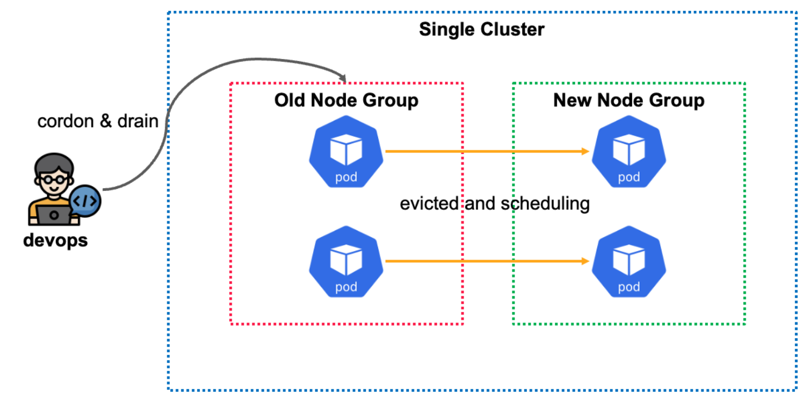
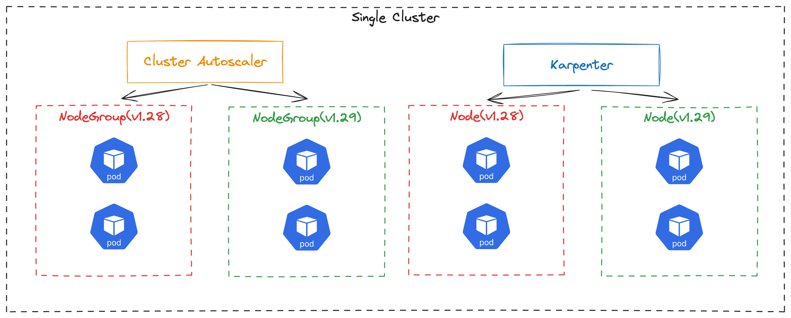

# Part CH09_03. 싱글 클러스터 버전 업그레이드 프로세스
> **주의사항**
terraform으로 프로비저닝된 리소스 및 서비스들은 시나리오 종료시마다 반드시 `terraform destroy` 명령어를 사용하여 정리해주세요. 그렇지 않으면, 불필요한 비용이 많이 발생할 수 있습니다. AWS 비용 측정은 시간당으로 계산되기에 매번 리소스를 생성하고 삭제하는 것이 불편하실 수도 있겠지만, 비용을 절감시키기 위해서 권장드립니다. 본인의 상황에 맞게 진행해주세요.

<br>

## 챕터명

안정적인 클러스터 버전 업그레이드

<br><br>

## 내용

클러스터 버전을 업그레이드 하는 것은 보안 업데이트와 버그 수정 및 새로운 기능과 개선 사항을 반영하기 위해서 주기적으로 꼭 진행해야 하는 프로세스입니다. 다만, 클러스터를 업그레이드 하는 것은 여간 힘든 작업이 아닙니다. 고려해야 할 부분도 많습니다. 예를 들어, `서비스의 다운타임을 발생시키지 않기 위해서는 어떤 전략을 채택해야 하는가?`, `PV를 사용하는 서비스의 데이터 정합성 및 일관성을 유지하려면 어떻게 해야하는가?` 등의 고민이 있습니다. 어느 정도 EKS를 안전하게 업그레이드 하는 방법이 정형화 되었고, 그러한 방법 중, `싱글 클러스터`를 기준으로 업그레이드를 진행하는 프로세스에 대해서 실습을 진행해 보고자 합니다.

<br>


**[그림1. cordon과 drain을 이용하여 수동으로 EKS 노드 버전을 업그레이드]**

<br>


**[그림2. CA와 karpenter를 사용하여 자동으로 EKS 노드 버전을 업그레이드]**

<br><br>

## 환경

- Terraform
- EKS
- Karpenter
- Sample application

<br><br>

## 시나리오

싱글 클러스터에서 `Cluster Autoscaler`을 사용하여 노드 그룹을 업그레이드하고, `karpenter`를 이용해서 노드 버전을 자동으로 업그레이드합니다.

<br><br>

## 주요 명령어

```bash
terraform init                    # 테라폼 모듈 다운로드 및 초기화 작업 진행
terraform plan                    # 테라폼으로 파일에 명시된 리소스들을 프로비저닝 하기 전 확인단계
terraform apply                   # 테라폼으로 파일에 명시된 리소스들을 프로비저닝
terraform destroy                 # 테라폼으로 파일에 명시된 리소스들을 삭제함

kubectl config current-context    # 현재 나의 로컬환경에 연결되어 있는 클러스터 확인
kubectl apply -f {파일명}           # yaml 파일에 기재된 쿠버네티스 리소스들을 생성
kubectl delete -f {파일명}          # yaml 파일에 기재된 쿠버네티스 리소스들을 삭제

echo "GET {NGINX_로드밸런서_엔드포인트}" | vegeta attack -duration=240s -rate=100 | vegeta report    # 스트레스 테스트를 진행

kubectl cordon {노드 이름}           # 해당 노드에 스케쥴링 될 수 없도록 함
kubectl uncordon {노드 이름}         # 해당 노드에 스케쥴링 될 수 있도록 함
kubectl drain {노드 이름}            # 해당 노드의 파드를 축출함
kubectl drain {노드 이름} --ignore-daemonsets --force    # daemonset은 파드 축출 대상에서 제외
```

<br><br>

## 실제 실습 명령어

```bash
# 0. 실습 환경 구축
terraform -chdir=../ plan 
terraform -chdir=../ apply --auto-approve

# 1. 샘플 애플리케이션 배포
kubectl apply -f sample-app.yaml

# 2. curl 명령어를 통해 샘플 애플리케이션 호출 테스트
curl "http://$(kubectl get -n 08-senario ingress/nginx-ingress -o jsonpath='{.status.loadBalancer.ingress[*].hostname}')"

# 3. 서비스가 운영 중인 상황을 가장하기 위해 초당 5개씩 해당 샘플 애플리케이션에 트래픽을 전송함
echo "GET http://$(kubectl get -n 08-senario ingress/nginx-ingress -o jsonpath='{.status.loadBalancer.ingress[*].hostname}')" | vegeta attack -duration=240s -rate=5 | vegeta report

# 4. 샘플 애플리케이션 삭제
kubectl delete -f sample-app.yaml

# 5. 실습 환경 제거
terraform -chdir=../ destroy --auto-approve
```

<br><br>

## 파일 설명
|파일명|설명|
|---|---|
|sample-app.yaml|EKS 버전 업그레이드 하는 동안 서비스의 다운타임을 체크할 샘플 애플리케이션|

<br><br>

## 참고
- [Onfido’s Journey to a Multi-Cluster Amazon EKS Architecture](https://aws.amazon.com/ko/blogs/containers/onfidos-journey-to-a-multi-cluster-amazon-eks-architecture/)
- [Planning Kubernetes Upgrades with Amazon EKS](https://aws.amazon.com/ko/blogs/containers/planning-kubernetes-upgrades-with-amazon-eks/)
- [How to upgrade Amazon EKS worker nodes with Karpenter Drift](https://aws.amazon.com/ko/blogs/containers/how-to-upgrade-amazon-eks-worker-nodes-with-karpenter-drift/)