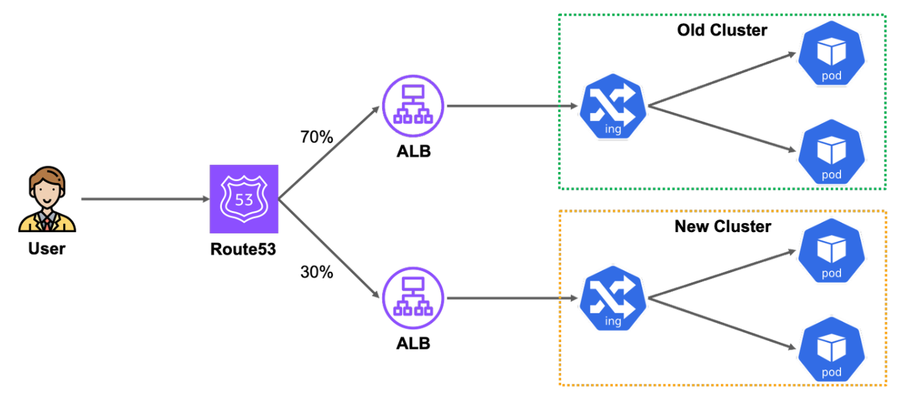

# Part CH09_04. 멀티 클러스터 버전 업그레이드 프로세스
> 멀티 클러스터 버전을 업그레이드 하는 실습은 기본적으로 EKS를 두 개 이상 필요하기에 일반적인 상황보다 과금이 더 발생할 수 있습니다. 이러한 점을 인지하고 진행하시기 바랍니다. 상황에 따라서 실습 영상으로만 해당 내용을 파악하셔도 크게 무리가 없습니다.

> **주의사항**
terraform으로 프로비저닝된 리소스 및 서비스들은 시나리오 종료시마다 반드시 `terraform destroy` 명령어를 사용하여 정리해주세요. 그렇지 않으면, 불필요한 비용이 많이 발생할 수 있습니다. AWS 비용 측정은 시간당으로 계산되기에 매번 리소스를 생성하고 삭제하는 것이 불편하실 수도 있겠지만, 비용을 절감시키기 위해서 권장드립니다. 본인의 상황에 맞게 진행해주세요.

<br>

## 챕터명

멀티 클러스터 버전 업그레이드 프로세스

<br><br>

## 내용

클러스터 버전을 업그레이드 방법 중, `멀티 클러스터`를 기준으로 업그레이드를 진행하는 프로세스에 대해서 실습을 진행해 보고자 합니다.

<br>


**[그림1. 멀티 클러스터를 이용하여 EKS 노드 버전을 업그레이드]**

<br><br>

## 환경

- Terraform
- EKS
- ALB
- Route53
- Ingress
- Karpenter
- Sample application

<br><br>

## 시나리오

1. 멀티 클러스터 환경에서 서비스의 다운타임을 최소화하여 노드 버전을 업그레이드해보자

<br><br>

## 주요명령어

```bash
terraform init                    # 테라폼 모듈 다운로드 및 초기화 작업 진행
terraform plan                    # 테라폼으로 파일에 명시된 리소스들을 프로비저닝 하기 전 확인단계
terraform apply                   # 테라폼으로 파일에 명시된 리소스들을 프로비저닝
terraform destroy                 # 테라폼으로 파일에 명시된 리소스들을 삭제함

kubectl config current-context    # 현재 나의 로컬환경에 연결되어 있는 클러스터 확인
kubectl apply -f {파일명}           # yaml 파일에 기재된 쿠버네티스 리소스들을 생성
kubectl delete -f {파일명}          # yaml 파일에 기재된 쿠버네티스 리소스들을 삭제제외
```

<br><br>

## 참고
- [Onfido’s Journey to a Multi-Cluster Amazon EKS Architecture](https://aws.amazon.com/ko/blogs/containers/)
