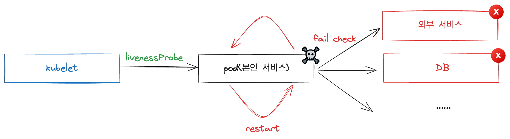
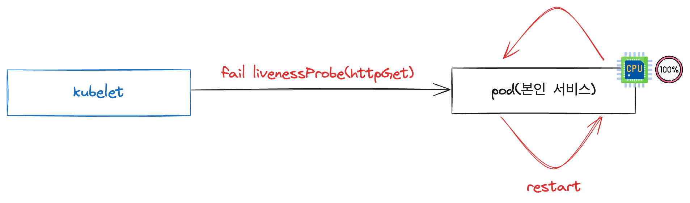

# Part CH11_02. 시나리오 설명 및 실습
> **주의사항**
terraform으로 프로비저닝된 리소스 및 서비스들은 시나리오 종료시마다 반드시 `terraform destroy` 명령어를 사용하여 정리해주세요. 그렇지 않으면, 불필요한 비용이 많이 발생할 수 있습니다. AWS 비용 측정은 시간당으로 계산되기에 매번 리소스를 생성하고 삭제하는 것이 불편하실 수도 있겠지만, 비용을 절감시키기 위해서 권장드립니다. 본인의 상황에 맞게 진행해주세요.

<br>

## 챕터명

livenessProbe의 치명적 단점

<br><br>

## 내용

LivenessProbe는 쿠버네티스에서 컨테이너가 언제 재시작되어야 하는지 결정하는 메커니즘을 제공합니다. 이는 쿠버네티스 클러스터 내의 애플리케이션 운영의 안정성과 지속성을 보장하는 핵심 기능 중 하나입니다.

다만, LivenessProbe를 맹신하면 안됩니다. 잘못된 설정 및 완벽한 통제가 되지않으면 서비스의 다운타임을 발생시킬 수 있는 매우 큰 위험을 초래할 수 있습니다.

LiveneesProbe로 인해 서비스 다운타임이 발생하는 시나리오를 진행해봅니다.

<br>


**[그림1. 외부 서비스 및 DB가 다운됨에 따라서 자신의 서비스도 비정상적으로 restart되는 현상]**

<br>


**[그림2. CPU Intensive한 서비스에 LivenessProbe에 실패하여 비정상적으로 restart되는 현상]**

<br><br>

## 환경

- Terraform
- EKS
- Karpenter
- Sample application

<br><br>

## 시나리오

1. 외부 서비스를 이용하는 서비스에서 해당 외부 서비스가 다운되었을 때, 본인의 서비스도 영향을 미치는 상황을 재현해봅니다.
2. 서비스의 헬스체크 중, DB의 Uptime도 포함되어 있을 때, 해당 DB에 문제를 생기게 하고 그로 인해 자신의 서비스도 영향을 미치는 상황을 재현해봅니다.
3. CPU Intensive한 서비스에서 LivenessProbe 체크를 httpGet을 진행할 경우, 문제가 생기는 경우를 재현해봅니다.

<br><br>

## 주요명령어

```bash
terraform init                    # 테라폼 모듈 다운로드 및 초기화 작업 진행
terraform plan                    # 테라폼으로 파일에 명시된 리소스들을 프로비저닝 하기 전 확인단계
terraform apply                   # 테라폼으로 파일에 명시된 리소스들을 프로비저닝
terraform destroy                 # 테라폼으로 파일에 명시된 리소스들을 삭제함

kubectl config current-context    # 현재 나의 로컬환경에 연결되어 있는 클러스터 확인
kubectl apply -f {파일명}           # yaml 파일에 기재된 쿠버네티스 리소스들을 생성
kubectl delete -f {파일명}          # yaml 파일에 기재된 쿠버네티스 리소스들을 삭제제외
```
