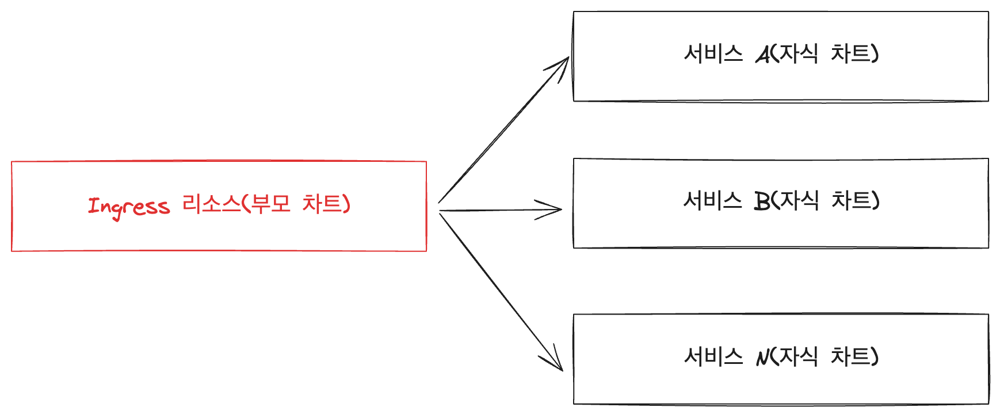
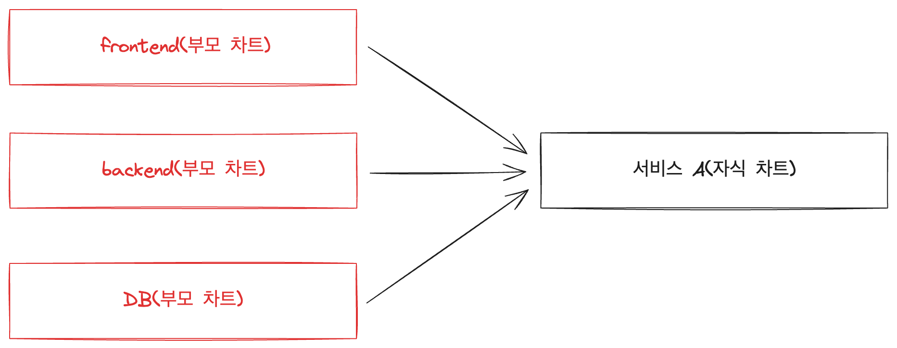

# Part CH12_02. 시나리오 설명 및 실습
> **주의사항**
terraform으로 프로비저닝된 리소스 및 서비스들은 시나리오 종료시마다 반드시 `terraform destroy` 명령어를 사용하여 정리해주세요. 그렇지 않으면, 불필요한 비용이 많이 발생할 수 있습니다. AWS 비용 측정은 시간당으로 계산되기에 매번 리소스를 생성하고 삭제하는 것이 불편하실 수도 있겠지만, 비용을 절감시키기 위해서 권장드립니다. 본인의 상황에 맞게 진행해주세요.

<br>

## 챕터명

실무자의 운영성을 높이기 위하여 Umbrella Helm Chart 적용

<br><br>

## 내용

서비스를 운영하다 보면 기능 및 컴플라이언스를 전사 서비스에 적용하고 관리해야 하는 니즈가 있을 수 있습니다. 이 때, Umbrella Helm Chart를 이용하면 쉽고 빠르게 해당 서비스를 운영할 수 있습니다. 그러한 상황에 대해 실습을 진행해 봅니다.

<br>


**[그림1. 모든 서비스에서 특별 관리되고 있는 Ingress 리소스를 포함시켜야 하는 경우]**

<br>


**[그림2. 쉽고 간편하게 frontend, backend, DB가 포함된 서비스를 배포하고자 하는 경우]**

<br><br>

## 환경

- Terraform
- EKS
- Karpenter
- helm
- Sample application

<br><br>

## 시나리오

쉽고 간편하게 frontend, backend, DB가 포함된 서비스를 배포하는 시나리오를 진행해 봅니다.

<br><br>

## 주요명령어

```bash
terraform init                    # 테라폼 모듈 다운로드 및 초기화 작업 진행
terraform plan                    # 테라폼으로 파일에 명시된 리소스들을 프로비저닝 하기 전 확인단계
terraform apply                   # 테라폼으로 파일에 명시된 리소스들을 프로비저닝
terraform destroy                 # 테라폼으로 파일에 명시된 리소스들을 삭제함

kubectl config current-context    # 현재 나의 로컬환경에 연결되어 있는 클러스터 확인

helm template {relase 이름} {차트가 포함된 DIR}                  # 실제 클러스터 환경에 적용되기 전 dry-run과 같이 메니페스트를 출력
helm template {relase 이름} {차트가 포함된 DIR} > output.yaml    # 실제 클러스터 환경에 적용되기 전 dry-run과 같이 메니페스트를 파일에 출력
helm install {release 이름} {차트가 포함된 DIR}                  # 클러스터 환경에 helm 차트를 배포
helm upgrade --install {차트가 포함된 DIR}                      # 클러스터 환경에 helm 차트를 배포하거나 업데이트
```

<br><br>

## 실제 실습 명령어

```bash
# 0. 실습 환경 구축
terraform -chdir=../ plan 
terraform -chdir=../ apply --auto-approve

# 1. namespace 생성
kubectl create ns 10-senario

# 2. umbrella helm 차트로 frontend, backend, db 배포
helm install my-10-senario umbrella-helm-chart --namespace 10-senario

# 3. umbrella helm 차트 삭제
helm delete my-10-senario --namespace 10-senario

# 4. 실습 환경 제거
terraform -chdir=../ destroy --auto-approve
```

<br><br>

## 파일 설명
|파일명|설명|
|---|---|
|backend|실습에서 사용할 백엔드 소스 디렉토리|
|frontend|실습에서 사용할 프론트엔드 소스 디렉토리|
|umbrella-helm-chart|실습에서 사용할 프론트엔드, 백엔드, DB 차트 모음집|
|senario.yaml|umbrella-helm-chart를 구성하기 위한 메니페스트|
