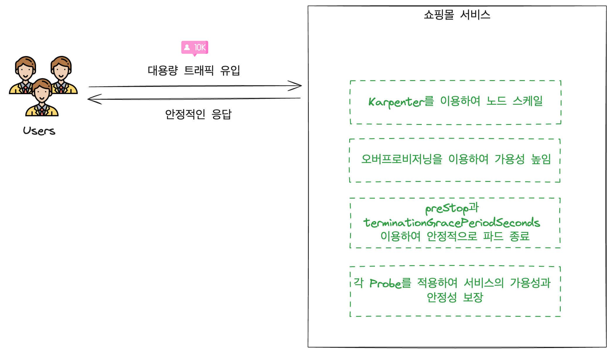
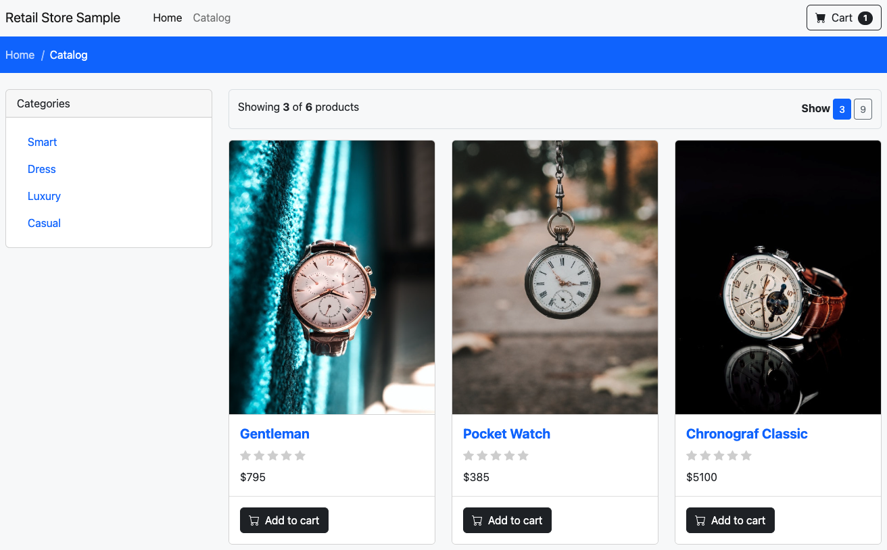
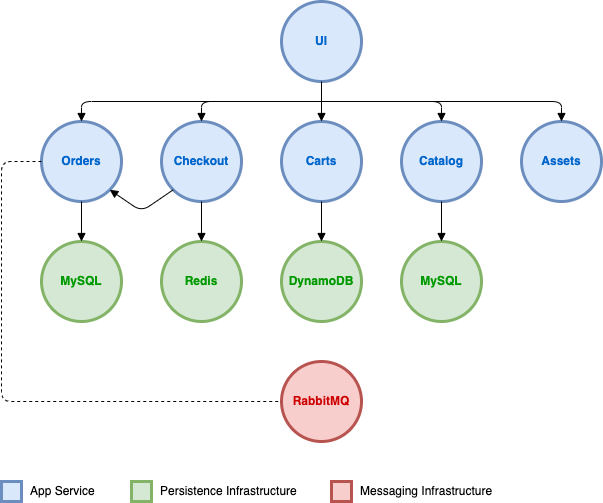

# 🛍️ Part CH13_01. 쇼핑몰 서비스에서 대용량 트래픽이 들어왔을 때, 유연하게 처리해본다.
> **⚠️ 주의사항**
terraform으로 프로비저닝된 리소스 및 서비스들은 시나리오 종료시마다 반드시 `terraform destroy` 명령어를 사용하여 정리해주세요. 그렇지 않으면, 불필요한 비용이 많이 발생할 수 있습니다. AWS 비용 측정은 시간당으로 계산되기에 매번 리소스를 생성하고 삭제하는 것이 불편하실 수도 있겠지만, 비용을 절감시키기 위해서 권장드립니다. 본인의 상황에 맞게 진행해주세요.

<br>

## 📚 챕터명

쇼핑몰 서비스에서 대용량 트래픽이 들어왔을 때, 유연하게 처리해본다.(실무 미션)

<br><br>

## 📝 내용

실제 쇼핑몰 서비스에서 대용량 트래픽이 들어왔을 때, 어떻게 유연하게 대응하는지 시나리오를 진행해 봅니다. 이 때, 다음과 같은 기술들이 총 집합되어 적용됩니다.

- `karpenter`를 이용하여 노드 스케일에 유연하게 대응
- `overprovisioning` 기술을 적용하여 순간적인 트래픽에 더 유연하게 대응
- `preStop` hook과 `terminationGracePeriodSeconds`을 적용하여 안정적으로 파드가 종료되도록 함
- `livenessProbe`, `readinessProbe`, `startupProbe`를 적용하여 서비스의 가용성과 안정성을 높임s

<br>


**[그림1. 대용량 트래픽이 유입될 때, 각 적절한 기술을 사용하여 안정적인 대응을 하는 모습]**

<br><br>

## 🌐 환경

- Terraform
- EKS
- ALB
- Karpenter
- Overprovisioning pod
- Sample application

<br><br>

## 🎬 시나리오

쇼핑몰 서비스에서 대용량 트래픽이 들어왔을 때, 유연하게 처리해봅니다.
다음은 쇼핑몰 서비스를 구축했을 때 표현되는 화면과 그에 따른 아키텍쳐 입니다.


**[그림2. 샘플 쇼핑몰 서비스에 대한 화면]**

<br>


**[그림3. 샘플 쇼핑몰 서비스에 대한 아키텍쳐]**

- **🔧 기타**: 위의 시나리오에 더해 서비스의 가용성을 높이기 위해서 readinessProbe를 적용합니다.
- **🎯 첫 번째 시나리오**: 파드가 스케일 아웃되지 않는 상황에서, 트래픽을 주어 서비스의 장애가 일어나게 합니다. 이에 대한 해결책으로 파드를 스케일 아웃하는 HPA와 노드를 스케일 아웃하는 karpenter를 이용하여 트래픽 유입에 따라 적절하게 파드를 스케일 아웃해봅니다.
- **🔧 기타**: 오버 프로비저닝 파드 적용.
- **🔧 기타**: ALB 알고리즘 변경
- **🎯 두 번째 시나리오**: 트래픽이 유입되는 상황에서, 배포 및 스케일 인 등의 파드가 재시작 될 때, 500번대 에러를 발생시켜 봅니다. 이에 대한 해결책으로 preStop과 terminationGracePeriodSeconds을 이용하여 문제를 해결해 보도록 합니다.

<br><br>

## 📌 주요명령어

```bash
terraform init                    # 테라폼 모듈 다운로드 및 초기화 작업 진행
terraform plan                    # 테라폼으로 파일에 명시된 리소스들을 프로비저닝 하기 전 확인단계
terraform apply                   # 테라폼으로 파일에 명시된 리소스들을 프로비저닝
terraform destroy                 # 테라폼으로 파일에 명시된 리소스들을 삭제함

kubectl config current-context    # 현재 나의 로컬환경에 연결되어 있는 클러스터 확인
kubectl apply -f {파일명}           # yaml 파일에 기재된 쿠버네티스 리소스들을 생성
kubectl delete -f {파일명}          # yaml 파일에 기재된 쿠버네티스 리소스들을 삭제제외
```

<br><br>

## 🛠️ 실제 실습 명령어

```bash
# 0. 실습 환경 구축
terraform -chdir=../ plan 
terraform -chdir=../ apply --auto-approve

# 1. 실습 쇼핑몰 배포
kustomize build ./real | kubectl apply -f -

# 2. 쇼핑몰 애플리케이션 배포 확인
watch kubectl get all --namespace 11-senario

# 3. UI 엔드포인트 주소 조회
kubectl get -n 11-senario ing ui

# 4. curl 명령어를 통해 쇼핑몰 UI 호출 테스트
watch -n 2 curl "http://$(kubectl get -n 11-senario ingress/ui -o jsonpath='{.status.loadBalancer.ingress[*].hostname}')/actuator/health/readiness"

# 5. 쇼핑몰에 초당 80개씩 1000s 동안 해당 쇼핑몰 UI 트래픽을 전송함
echo "GET http://$(kubectl get -n 11-senario ingress/ui -o jsonpath='{.status.loadBalancer.ingress[*].hostname}')" | vegeta attack -duration=1000s -rate=100 | vegeta report

# 6. 실습 쇼핑몰 삭제
kustomize build ./real | kubectl delete -f -

# 7. 실습 환경 제거
terraform -chdir=../ destroy --auto-approve
```

<br><br>

## 📁 파일 설명
|파일명|언어|설명|
|---|---|---|
|01-catalog.yaml|Java|Product catalog API|
|02-carts.yaml|Go|User shopping carts API|
|03-orders.yaml|Java|User orders API|
|04-checkout.yaml|Java|API to orchestrate the checkout process|
|05-assets.yaml|Node|Serves static assets like images related to the product catalog|
|06-ui.yaml|NginX|Aggregates API calls to the various other services and renders the HTML UI.|

<br><br>

## 📚 참고
- [retail-store-sample-app 소스 코드](https://github.com/aws-containers/retail-store-sample-app)
- [Liveness and Readiness Probes with Spring Boot](https://spring.io/blog/2020/03/25/liveness-and-readiness-probes-with-spring-boot)