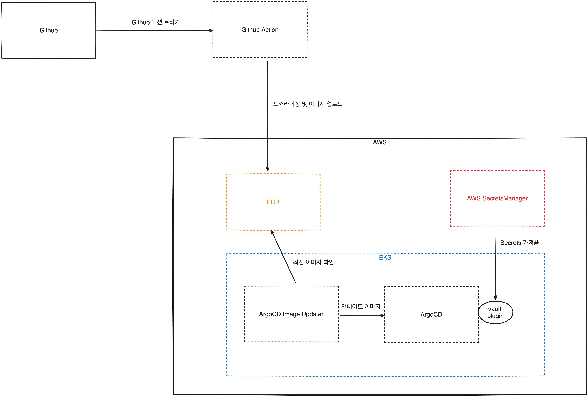

# 🚀 CH01_01. 사전준비
> **⚠️ 주의사항**
이 실습 강의를 진행하기 위해서는 다음과 같은 사전 준비가 필요합니다.
> - AWS 계정이 필요합니다.
> - Github Action을 사용하기 위해서는 Github 계정이 필요합니다.
> - Terraform으로 인프라를 프로비저닝 합니다.
> - EKS 클러스터를 생성합니다.
> - kubectl, kustomize, helm을 이용하여 쿠버네티스 클러스터를 관리합니다.

  

## 인프라 환경
실습에서 진행할 인프라 환경은 다음과 같습니다.

1. 도커와 Github 액션을 이용하여 빌드속도를 최적화 해봅니다.
2. 컨테이너 이미지를 경량화하여 업로드 속도와 배포 속도를 최적화 해봅니다.
3. ECR을 이용하여 공개 저장소의 제약을 해결해봅니다.
4. ArgoCD Image Updater를 이용하여 이미지 업데이트를 자동화 해봅니다.
5. ArgoCD Vault Plugin을 이용하여 보안을 강화해봅니다.
6. ArgoCD를 이용하여 Orphaned Resources를 관리해봅니다.

