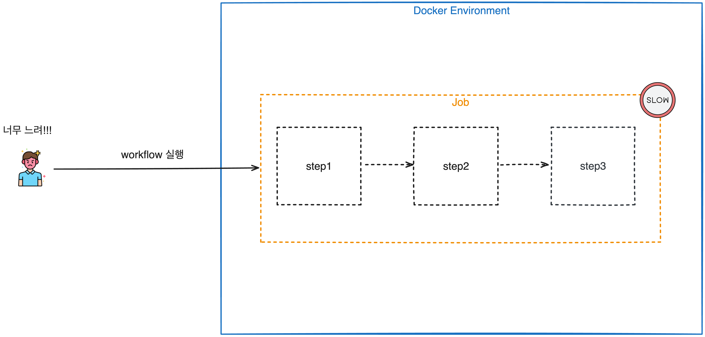
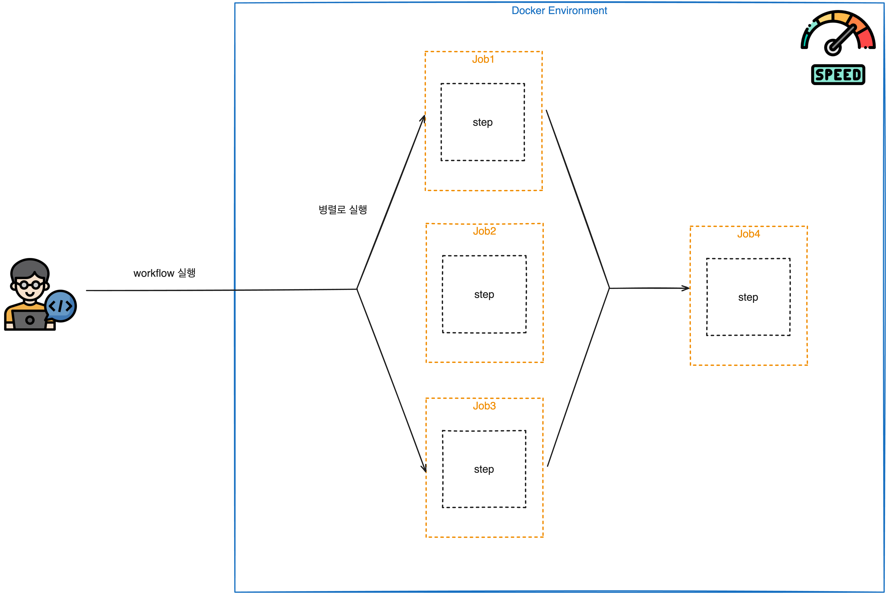

# 🚀 CH02_03. 시나리오 설명 및 실습

> 이 시나리오는 CI 빌드 속도를 개선하는 방법에 대해 설명합니다. 실습을 진행하기 전에 아래의 실습환경이 구축되어 있는지 확인하십시오.
> - Docker Desktop v4.15.0
> - act v0.2.56

<br>

## 📚 챕터명

CI 빌드속도 개선

<br><br>

## 📝 내용

이 시나리오에서는 CI 빌드 속도를 개선하는 다양한 방법을 탐색합니다. 캐싱 전략, 병렬 빌드 등의 다양한 기법을 사용하여 빌드 속도를 향상시킬 수 있습니다.


**[그림1. 빌드 속도가 느린 경우]**

<br>


**[그림2. 병렬로 실행하여 빌드 속도를 높인 경우]**

<br><br>

## 🌐 환경

- Docker Desktop v4.15.0: 로컬 환경에서 컨테이너를 실행하기 위한 도구이며, ack를 실행하기 위해서 필요합니다.
- ack: 로컬에서 GitHub Actions 워크플로우를 실행하기 위한 도구입니다.

<br><br>

## 🎬 시나리오

> 실제 실습은 Github Actions과 비슷하게 동작하도록 Docker와 act를 사용합니다.
> 
> **⚠️ 주의사항: act는 GitHub Actions를 로컬에서 실행하기 위한 도구이며, GitHub Actions와 완벽하게 동일하지는 않습니다.**

이 시나리오에서는 다음과 같은 작업을 수행합니다.

1. 캐싱 전략을 사용하여 종속성 설치 속도 개선
2. 병렬 빌드를 사용하여 여러 작업 동시 실행

<br><br>

## 📌 주요명령어

```bash
# act -l 명령어로 GitHub Actions 워크플로우 목록 확인
act -l

# act -W 명령어로 특정 워크플로우(느린 빌드 예시) 실행
act -W .github/workflows/build_slow.yaml

# act -W 명령어로 특정 워크플로우(빠른 빌드 예시) 실행
act -W .github/workflows/build_fast.yaml
```

<br><br>

## 🛠️ 실제 실습 명령어

```bash
# 1. 느린 빌드 실행
./build_test.sh build_slow.yaml

# 2. 빠른 빌드 실행
./build_test.sh build_fast.yaml
```

<br><br>

## 📁 파일 설명
|파일명|설명|
|---|---|
|.github/workflows|GitHub Actions 워크플로우를 정의하는 YAML 파일들이 존재하는 디렉토리|
|src|Node.js로 작성된 간단한 웹 애플리케이션을 구동하기 위한 소스 디렉토리|
|tests|test 코드가 존재하는 디렉토리|
|build_test.sh|빌드 테스트를 진행할 때 사용하는 스크립트|
|Dockerfile|애플리케이션을 컨테이너화하기 위한 Dockerfile|
|package-lock.json|프로젝트의 의존성 트리에 대한 정확한 정보를 저장하는 파일|
|package.json|프로젝트의 메타데이터와 의존성 정보를 포함하는 파일|
|server.js|웹 서버를 시작하는 역할|

<br><br>

## 📚 참고
- [Dockerfile best practices](https://docs.docker.com/develop/develop-images/dockerfile_best-practices/)
- [GitHub Actions documentation](https://docs.github.com/en/actions)
- [실습 도커 이미지 저장소](https://hub.docker.com/repository/docker/username/repo)
