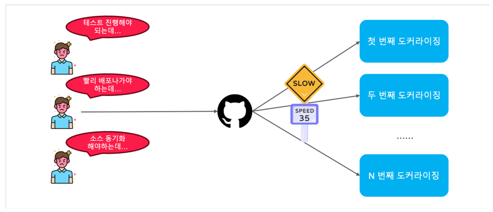
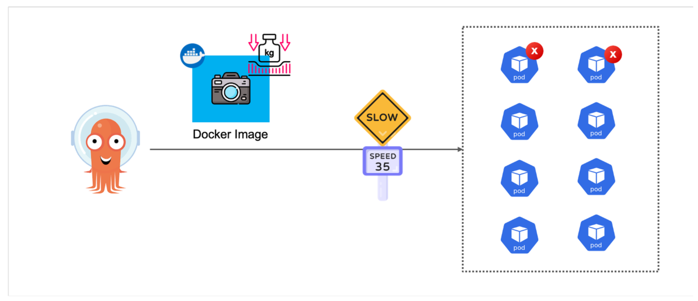
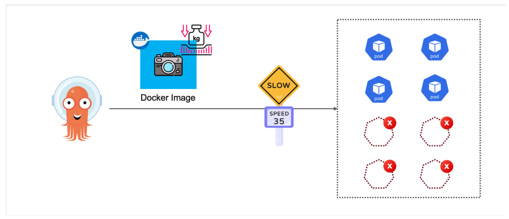

# CH16_03. 시나리오 설명 및 실습
> 이 시나리오는 도커라이징을 최적화하여 결과적으로, CI 빌드 속도를 개선하는 방법에 대해 설명합니다. 실습을 진행하기 전에 아래의 실습환경이 구축되어 있는지 확인하십시오.
> - Docker Desktop v4.15.0

<br>

## 챕터명

도커라이징 최적화

<br><br>

## 내용

이 시나리오에서는 도커라이징을 최적화하여 결과적으로, CI 빌드 속도를 개선하는 다양한 방법을 탐색합니다.
> 도커라이징이란, 애플리케이션을 도커 이미지로 만들어 배포하는 과정을 의미합니다.

다음은 도커라이징이 느릴 경우 발생하는 문제입니다.


**[그림1. 도커라이징이 느릴 경우]**

<br>


**[그림2. 이미지 크기로 인한 배포속도 저하]**

<br>


**[그림3. 이미지 크기로 인한 스케일 아웃 이슈]**

<br><br>

## 환경

- Docker Desktop v4.15.0

<br><br>

## 시나리오

다음과 같은 작업을 수행하여 도커라이징을 최적화합니다.

1. 최소한의 베이스 이미지 사용
2. && 연산자를 이용하여 RUN 명령어를 하나로 합치기
3. Multi-Stage 빌드를 사용하여 이미지 크기 최적화
4. 불필요한 파일 제거
5. 도커 빌드 캐시 활용
6. .dockerignore 파일을 이용하여 불필요한 파일 제외

<br><br>

## 주요명령어

```bash
# 도커 이미지 빌드
docker build -f {Dockerfile명} . -t {이미지명}

# 특정 도커 이미지 확인
docker images {이미지명}

# 특정 도커 이미지 삭제
docker rmi {이미지명}

# 스크립트 실행
./containerizing_test.sh {Dockerfile명} {이미지명}
```

<br><br>

## 실제 실습 명령어

```bash
# 최적화되지 않은 도커 이미지 빌드하여 빌드시간과 이미지 크기 확인
./containerizing_test.sh Dockerfile.bad part02-03-senario-bad_case

# 최적화된 도커 이미지 빌드하여 빌드시간과 이미지 크기 확인
./containerizing_test.sh Dockerfile.optimize part02-03-senario-optimize

# 실습 종료 후, 이미지 삭제
docker rmi -f $(docker images -q 'part02-03-senario*') 2>/dev/null
```

<br><br>

## 파일 설명
|파일명|설명|
|---|---|
|app.py|flask를 이용한 간단한 웹 서버|
|containerizing_test.sh|도커 이미지 빌드 및 실행을 위한 스크립트|
|Dockerfile.bad|최적화되지 않은 도커 이미지 빌드를 위한 파일|
|Dockerfile.optimize|최적화된 도커 이미지 빌드를 위한 파일|
|requirements.txt|필요한 라이브러리 목록을 정의한 파일|
