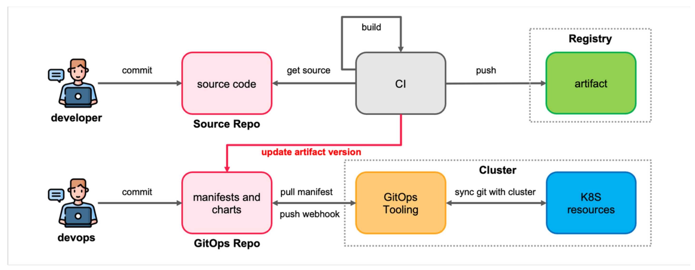
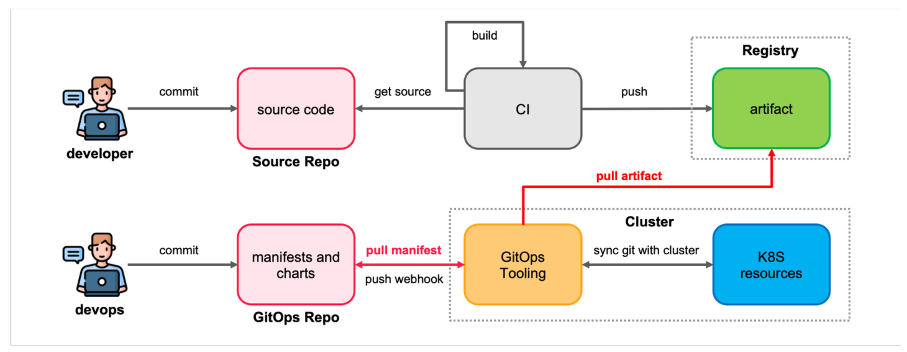
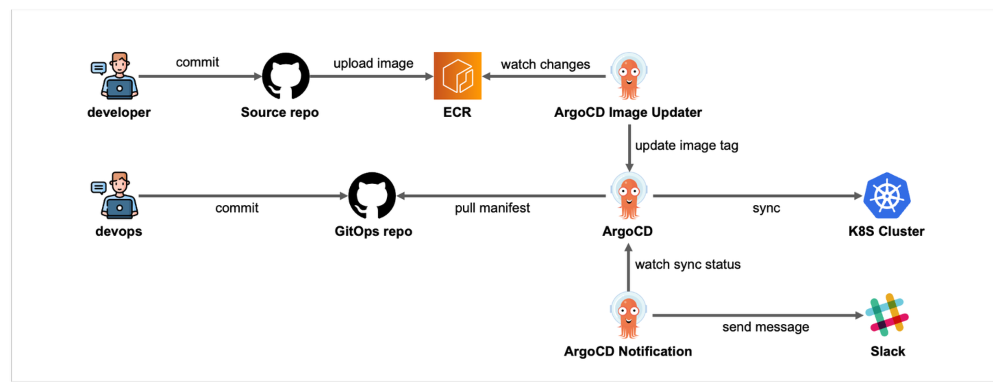

# 🚀 CH18_03. 시나리오 설명 및 실습
> **주의사항**
terraform으로 프로비저닝된 리소스 및 서비스들은 시나리오 종료시마다 반드시 `terraform destroy` 명령어를 사용하여 정리해주세요. 그렇지 않으면, 불필요한 비용이 많이 발생할 수 있습니다. AWS 비용 측정은 시간당으로 계산되기에 매번 리소스를 생성하고 삭제하는 것이 불편하실 수도 있겠지만, 비용을 절감시키기 위해서 권장드립니다. 본인의 상황에 맞게 진행해주세요.

<br>

## 챕터명

ArgoCD Image Updater를 사용하여 완전한 pull 방식을 지향

<br><br>

## 내용

GitOps 기반 배포 프로세스의 장점은 변경 사항을 Git 저장소에 커밋하고, 이를 통해 배포를 진행할 수 있다는 것입니다. 이러한 방식은 배포 프로세스를 추적하고, 변경 사항을 관리하기 쉽게 만들어줍니다. 또한, 클러스터의 상태를 Git 저장소에 저장하여, 클러스터의 상태를 복원할 수 있습니다.

이 때, push 방식과 pull 방식의 배포 프로세스가 존재합니다.

<br>

push 방식은 GitOps의 기본적인 방식으로, Git 저장소에 변경 사항을 커밋하고, 이를 트리거로 배포를 진행합니다. 이러한 방식은 변경 사항을 추적하기 쉽고, 변경 사항을 관리하기 쉽게 만들어줍니다. 다만, 다음의 단점이 존재합니다.

**[그림1. push 기반 GitOps 배포 프로세스]**

- 잘못된 코드나 설정이 Git 저장소에 푸시되면 이로 인해 배포가 실패하거나 시스템에 오류가 발생할 수 있습니다.
- 변경 사항이 즉시 반영되지 않고, 명시적으로 푸시되어야 합니다. 이는 여러 환경이나 서버 간의 일관성을 유지하기 어렵게 만들 수 있습니다.
- 변경 사항이 Git 저장소에 푸시되어야만 반영됩니다. 이는 실시간으로 변경 사항을 반영하기 어렵게 만들 수 있으며, 배포 과정이 지연될 수 있습니다.
- 소스 레포와 GitOps 레포가 연결되어 있어, 소스 레포의 개수가 많아질수록 관리가 어려워질 수 있습니다.
- 파이프라인이 Git 리포지토리에 직접 쓰기 권한을 가져야 합니다.

<br>

pull 방식은 GitOps의 확장된 방식으로, Git 저장소에 변경 사항을 커밋하고, 이를 트리거로 배포를 진행합니다. 이러한 방식은 변경 사항을 추적하기 쉽고, 변경 사항을 관리하기 쉽게 만들어줍니다. 또한, 다음의 장점이 존재합니다.

**[그림2. pull 기반 GitOps 배포 프로세스]**

- 변경 사항이 Git 저장소에 푸시되지 않아도, 일정 주기로 클러스터의 상태를 갱신할 수 있습니다. 이는 실시간으로 변경 사항을 반영하기 쉽게 만들어줍니다.
- 소스 레포와 GitOps 레포가 분리되어 있어, 소스 레포의 개수가 많아져도 관리가 용이합니다.
- CI/CD 파이프라인이 Git에 직접 쓰지 않아도 된다는 것입니다. 이는 보안적인 측면에서 유리합니다.

<br>

이 중, ArgoCD Image Updater는 pull 방식의 배포 프로세스를 지원하는 도구입니다. ArgoCD Image Updater를 사용하여 이미지 업데이트를 자동화하고, ArgoCD를 통해 배포를 진행할 수 있습니다.

**[그림1. ArgoCD 인프라를 이용한 pull 기반 GitOps 배포 프로세스]**

ArgoCD Image Updater는 다음과 같은 기능을 제공합니다. 👉 [Features](https://argocd-image-updater.readthedocs.io/en/stable/#features)
- ArgoCD로 관리되는 애플리케이션의 이미지를 업데이트합니다. 이는 Helm 또는 Kustomize로 생성된 애플리케이션의 이미지를 업데이트합니다.
- 다양한 이미지 업데이트 전략을 설정할 수 있습니다.
> - `semver`: Semantic Versioning을 사용하여 이미지를 업데이트합니다.
> - `latest`: 가장 최근에 생성된 이미지 태그로 업데이트합니다.
> - `name`: 이미지 이름을 기준으로 가장 마지막 태그를 사용합니다.
> - `digest`: 가장 최근에 푸시된 버전으로 업데이트합니다.  
- 기타 등등.

<br><br>

## 환경

> 이 시나리오는 ArgoCD Image Updater를 이용하여 pull 기반의 배포 프로세스를 진행하는 방법에 대해 설명합니다. 실습을 진행하기 전에 아래의 실습환경이 구축되어 있는지 확인하십시오.

- EKS v1.28
- Terraform CLI v1.6.6
- kubectl v1.28.4
- Docker Desktop v4.15.0
- ArgoCD v2.11.3(👉 https://argo-cd.readthedocs.io/en/stable/getting_started/)
- ArgoCD Image Updater v0.12.0(👉 https://argocd-image-updater.readthedocs.io/en/stable/install/installation/)
- ArgoCD CLI v2.8.6(👉 https://argo-cd.readthedocs.io/en/stable/cli_installation/)

<br><br>

## 시나리오

이 시나리오에서는 ArgoCD Image Updater를 사용하여 완전한 pull 방식을 지향하는 방법에 대해 설명합니다. ArgoCD Image Updater를 사용하여 이미지 업데이트를 자동화하고, ArgoCD를 통해 배포를 진행합니다.

<br><br>

## 파일 설명
|파일명|설명|
|app.py|flask를 이용한 간단한 웹 서버|
|deployment.yaml|flask 웹 서버를 배포하는 Deployment 리소스|
|Dockerfile|flask 웹 서버를 빌드하는 Dockerfile|
|kustomization.yaml|Kustomize를 이용한 배포 리소스 정의|
|requirements.txt|flask 웹 서버의 의존성 패키지 목록|

<br><br>

## 주요명령어

```bash
terraform init                    # 테라폼 모듈 다운로드 및 초기화 작업 진행
terraform plan                    # 테라폼으로 파일에 명시된 리소스들을 프로비저닝 하기 전 확인단계
terraform apply                   # 테라폼으로 파일에 명시된 리소스들을 프로비저닝
terraform destroy                 # 테라폼으로 파일에 명시된 리소스들을 삭제함

kubectl config current-context    # 현재 나의 로컬환경에 연결되어 있는 클러스터 확인
kubectl apply -f {파일명}           # yaml 파일에 기재된 쿠버네티스 리소스들을 생성
kubectl delete -f {파일명}          # yaml 파일에 기재된 쿠버네티스 리소스들을 삭제

# ArgoCD application 리스트 확인
argocd app list

# ArgoCD application 생성
argocd app create {APP_NAME} --repo {GIT_REPO} --path {PATH} --dest-server {DEST_SERVER} --dest-namespace {DEST_NAMESPACE} 

# ArgoCD application 상세정보 확인
argocd app get {APP_NAME}

# ArgoCD application 삭제
argocd app delete {APP_NAME}

# Docker 이미지 빌드
docker build --progress=plain --no-cache --platform linux/amd64 . -t {IMAGE_NAME} -f {DOCKERFILE}

# Docker 이미지 태그 추가
docker tag {SOURCE_IMAGE} {TARGET_IMAGE}

# port-forward
kubectl port-forward {RESOURCE}/{RESOURCE_NAME} {LOCAL_PORT}:{REMOTE_PORT}
```

<br><br>

## 실제 실습 명령어

```bash
# 0. 실습 환경 구축
terraform -chdir=../ init
terraform -chdir=../ plan
terraform -chdir=../ apply --auto-approve

# 1. ArgoCD 설치
kubectl create namespace argocd
kubectl apply -n argocd -f https://raw.githubusercontent.com/argoproj/argo-cd/stable/manifests/install.yaml
kubectl port-forward svc/argocd-server -n argocd 8080:443
argocd admin initial-password -n argocd
argocd login localhost:8080

# 2. ArgoCD Image Updater 설치
kubectl apply -n argocd -f https://raw.githubusercontent.com/argoproj-labs/argocd-image-updater/stable/manifests/install.yaml

# 3. ArgoCD CLI로 애플리케이션 배포
argocd app list
argocd app create test --repo https://github.com/Hulkong/fastcampus-devops-practice-examples-100.git --path '02-강의준비/05-senario' --dest-server https://kubernetes.default.svc --dest-namespace default --sync-policy auto
argocd app get argocd/test
kubectl port-forward deployments/kustomize-sample 5000:5000

# 4. v2.0.0으로 이미지 빌드
docker build --progress=plain --no-cache --platform linux/amd64 . -t hulkong/fastcampus-devops-practice-examples-100:part02-05-senario-v2.0.0 -f Dockerfile

# 5. Docker 레지스트리에 푸시
docker login 
docker push hulkong/fastcampus-devops-practice-examples-100:part02-05-senario-v2.0.0

# 6. ArgoCD Image Updater의 annotation 설정
kubectl annotate app test -n argocd \
    argocd-image-updater.argoproj.io/image-list=my-image=hulkong/fastcampus-devops-practice-examples-100 \
    argocd-image-updater.argoproj.io/my-image.allow-tags='regexp:^part02-05-senario-v\d+\.\d+\.\d+$' \
    argocd-image-updater.argoproj.io/my-image.update-strategy=name --overwrite

# 7. 이미지 태그 및 푸시
docker tag hulkong/fastcampus-devops-practice-examples-100:part02-05-senario-v2.0.0 hulkong/fastcampus-devops-practice-examples-100:part02-05-senario-v2.0.1
docker push hulkong/fastcampus-devops-practice-examples-100:part02-05-senario-v2.0.1

# 8. 리소스 정리 
argocd app delete argocd/test
kubectl delete -n argocd -f https://raw.githubusercontent.com/argoproj-labs/argocd-image-updater/stable/manifests/install.yaml
kubectl delete -n argocd -f https://raw.githubusercontent.com/argoproj/argo-cd/stable/manifests/install.yaml
terraform -chdir=../ destroy --auto-approve
```

<br><br>

## 참고

- [ArgoCD](https://argo-cd.readthedocs.io/en/stable/)
- [ArgoCD Image Updater](https://argocd-image-updater.readthedocs.io/en/stable/)
- [fastcampus-devops-practice-examples-100](https://hub.docker.com/repository/docker/hulkong/fastcampus-devops-practice-examples-100)