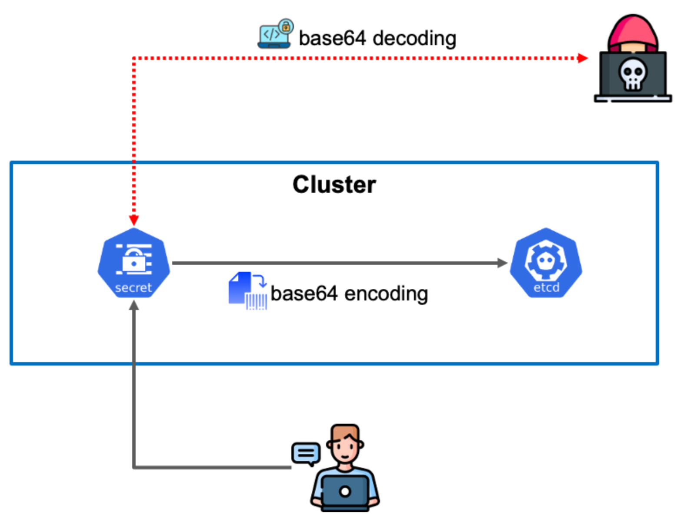
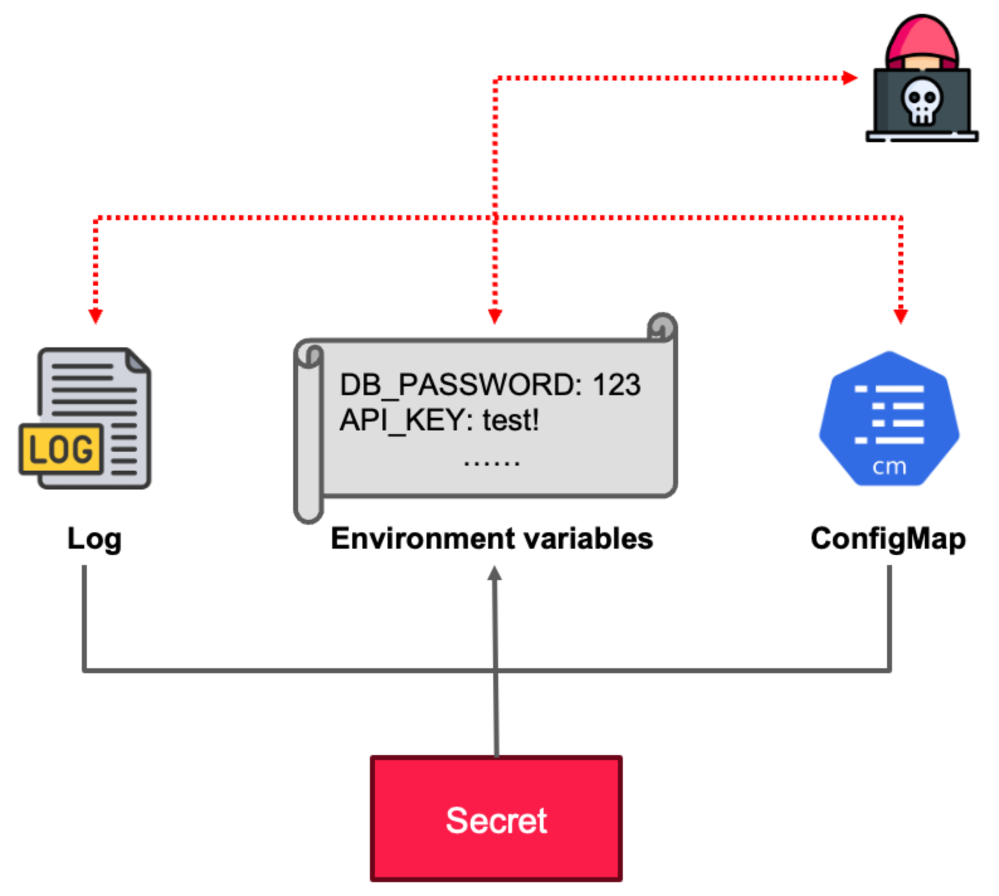
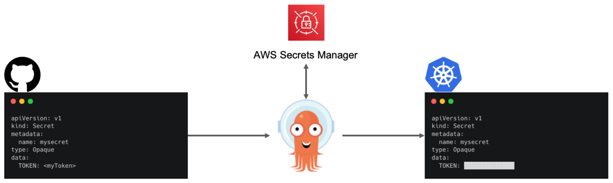
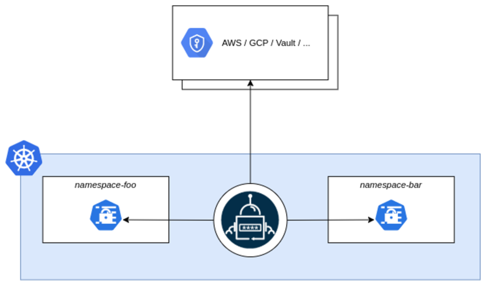
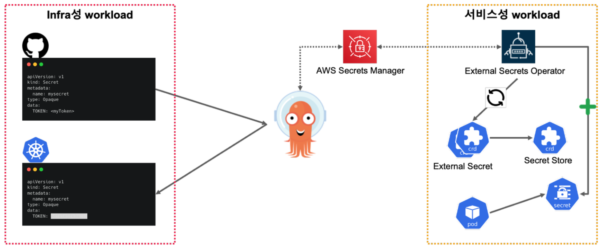

# CH19_03. 시나리오 설명 및 실습
> **주의사항**
terraform으로 프로비저닝된 리소스 및 서비스들은 시나리오 종료시마다 반드시 `terraform destroy` 명령어를 사용하여 정리해주세요. 그렇지 않으면, 불필요한 비용이 많이 발생할 수 있습니다. AWS 비용 측정은 시간당으로 계산되기에 매번 리소스를 생성하고 삭제하는 것이 불편하실 수도 있겠지만, 비용을 절감시키기 위해서 권장드립니다. 본인의 상황에 맞게 진행해주세요.

<br>

## 챕터명

ArgoCD에서 민감정보를 관리하고, 동기화 하는 방법

<br><br>

## 내용

ArgoCD에서 민감정보를 관리하고, 동기화 하는 방법에 대해 설명합니다.

다음은 Cluster 내부에 Secret이 노출되는 그림입니다.


**[그림1. base64로 디코딩 가능한 사례]**

<br>


**[그림2. 민감정보가 노출된 사례]**

<br><br>

그렇다면, 이러한 민감정보를 어떻게 관리하고, 동기화 할 수 있을까요? 이를 위해 ArgoCD Vault Plugin와 External Secret을 사용하여, 민감정보를 안전하게 관리하고, 동기화하는 방법에 대해 설명합니다.

> **ArgoCD Vault Plugin**
 ArgoCD와 HashiCorp Vault 또는 AWS Secrets Manager와 같은 Secret Management Systems를 통합하여, 쿠버네티스 Secret을 안전하게 관리하는 데 사용되는 도구입니다. 이 플러그인을 사용하면, ArgoCD는 Vault 또는 AWS Secrets Manager에 저장된 Secret을 읽어와서 쿠버네티스 클러스터에 배포할 수 있습니다.


**[그림3. ArgoCD Vault Plugin을 이용하여 민감정보 보호]**

<br><br>

> **External Secret**
 External Secrets는 쿠버네티스 환경에서 외부 Secret Management Systems에 저장된 Secret을 사용할 수 있게 해주는 도구입니다. 이를 통해 애플리케이션은 쿠버네티스 Secret처럼 외부 Secret Management Systems에 저장된 Secret을 사용할 수 있습니다. 이는 Secret을 쿠버네티스 클러스터 외부에 안전하게 저장할 수 있게 해주며, Secret의 라이프사이클을 쿠버네티스 클러스터와 독립적으로 관리할 수 있게 해줍니다.


**[그림4. External Secret을 이용하여 민감정보 보호]**

<br><br>

`ArgoCD Vault Plugin`과 `External Secret`의 차이점은 다음과 같습니다.
||EXTERNAL SECRETS OPERATOR|VAULT PLUGIN|
|---|---|---|
|Supported Secret Providers|**Total: 14**<br>- HashiCorp Vault<br>- AWS Secrets Manager<br>- Google Cloud Secrets Manager<br>- Azure Key Vault<br>- ......|**Total: 8**<br>-  HashiCorp Vault<br>- AWS Secrets Manager<br>- Google Cloud Secrets Manager<br>- Azure Key Vault<br>- ......|
|Requires Argo CD?|No|Yes|
|Requires Custom Resources and controllers?|Yes|No|
|Auto sync changes to external API secret?|Yes|No|
|Connect to multiple secret managers simultaneously?|Yes|No|

<br>

각 회사 및 팀의 정책에 따라 운영 방법이 다르겠지만, 별도의 리소스를 생성하지 않고, 동기화의 주기가 긴 인프라성 서비스에는 `ArgoCD Vault Plugin`을 사용하고, 동기화의 주기가 짧은 서비스에는 `External Secret`을 사용하는 것이 좋습니다.


**[그림5. AVP와 ESO의 사용처]**

<br><br>

## 환경

- EKS v1.28
- Terraform CLI v1.6.6
- kubectl v1.28.4
- helm v3.13.2
- kustomize v5.3.0
- ArgoCD v2.11.3(👉 https://argo-cd.readthedocs.io/en/stable/getting_started/)
- ArgoCD CLI v2.8.6(👉 https://argo-cd.readthedocs.io/en/stable/cli_installation/)
- ArgoCD Vault Plugin(👉 https://argocd-vault-plugin.readthedocs.io/en/stable/)
- ArgoCD Vault Plugin CLI v1.17.0(👉 https://argocd-vault-plugin.readthedocs.io/en/stable/cmd/avp/)
- AWS CLI v2.15.17
- AWS Secret Manager

<br><br>

## 시나리오

1. 별도의 Secret 관리 도구를 사용하지 않았을 때, Secret이 노출되는 사례를 확인합니다.
2. ArgoCD Vault Plugin을 사용하여 kustomize 및 helm 차트 내의 secret값을 관리하고, 변경시, 동기화를 진행합니다.
3. External Secret를 사용하여 secret값을 관리하고, 변경시, 동기화를 진행합니다.

<br><br>

## 파일 설명
|파일명|설명|
|---|---|
|cmp-sidecar|sidecar 패턴을 적용하여 ArgoCD Vault Plugin을 설치하는 디렉토리|
|helm-guestbook|ArgoCD Vault Plugin을 이용한 helm 예제 디렉토리|
|kustomize-guestbook-01|ArgoCD Vault Plugin을 이용한 kustomize 예제 디렉토리|
|kustomize-guestbook-02|External Secret을 이용한 kustomize 예제 디렉토리|

<br><br>

## 주요명령어

```bash
terraform init                    # 테라폼 모듈 다운로드 및 초기화 작업 진행
terraform plan                    # 테라폼으로 파일에 명시된 리소스들을 프로비저닝 하기 전 확인단계
terraform apply                   # 테라폼으로 파일에 명시된 리소스들을 프로비저닝
terraform destroy                 # 테라폼으로 파일에 명시된 리소스들을 삭제함

kubectl config current-context    # 현재 나의 로컬환경에 연결되어 있는 클러스터 확인
kubectl apply -f {파일명}           # yaml 파일에 기재된 쿠버네티스 리소스들을 생성
kubectl delete -f {파일명}          # yaml 파일에 기재된 쿠버네티스 리소스들을 삭제

# ArgoCD application 리스트 확인
argocd app list

# ArgoCD application 생성
argocd app create {APP_NAME} --repo {GIT_REPO} --path {PATH} --dest-server {DEST_SERVER} --dest-namespace {DEST_NAMESPACE} 

# ArgoCD application 상세정보 확인
argocd app get {APP_NAME}

# ArgoCD application 삭제
argocd app delete {APP_NAME}

# port-forward
kubectl port-forward {RESOURCE}/{RESOURCE_NAME} {LOCAL_PORT}:{REMOTE_PORT}

# helm 차트를 ArgoCD Vault Plugin을 이용하여 민감정보를 동적으로 생성
helm template {CHART_NAME} {CHART_PATH} --values {VALUES_FILE} | argocd-vault-plugin generate - | kubectl apply -f -

# kustomize를 ArgoCD Vault Plugin을 이용하여 민감정보를 동적으로 생성
kustomize build {WORKING DIRECTOR} | argocd-vault-plugin generate --verbose-sensitive-output - | kubectl apply -f -
```

<br><br>

## 실제 실습 명령어

```bash
# 0. 실습 환경 구축
terraform -chdir=../ init
terraform -chdir=../ plan
terraform -chdir=../ apply --auto-approve

# 1. ArgoCD 설치
kustomize build cmp-sidecar | kubectl apply -f -
kubectl port-forward svc/argocd-server -n argocd 8080:443
argocd admin initial-password -n argocd
argocd login localhost:8080

# 2. 민감정보가 노출되는 사례 확인
helm template helm-guestbook 00-not-secure-helm-guestbook --values 00-not-secure-helm-guestbook/values.yaml
helm install helm-guestbook ./00-not-secure-helm-guestbook --values 00-not-secure-helm-guestbook/values.yaml
helm delete helm-guestbook

# 3. 로컬에서 ArgoCD Vault Plugin CLI로 민감정보를 동적으로 생성 테스트
aws configure list
export AVP_TYPE=awssecretsmanager
export AWS_REGION=us-east-2
helm template helm-guestbook helm-guestbook --values helm-guestbook/values.yaml | argocd-vault-plugin generate --verbose-sensitive-output -
kustomize build kustomize-guestbook | argocd-vault-plugin generate --verbose-sensitive-output -

# 4. ArgoCD CLI로 애플리케이션 배포
argocd app list
argocd app create helm-guestbook --repo https://github.com/Hulkong/fastcampus-devops-practice-examples-100.git --path '02-강의준비/06-senario/01-helm-guestbook-with-avp' --dest-namespace default --dest-server https://kubernetes.default.svc
argocd app create kustomize-guestbook-01 --repo https://github.com/Hulkong/fastcampus-devops-practice-examples-100.git --path '01-kustomize-guestbook-with-avp' --dest-namespace default --dest-server https://kubernetes.default.svc
argocd app create kustomize-guestbook-02 --repo https://github.com/Hulkong/fastcampus-devops-practice-examples-100.git --path '02-kustomize-guestbook-with-eso' --dest-namespace default --dest-server https://kubernetes.default.svc

# 5. 리소스 정리 
argocd app delete argocd/helm-guestbook
argocd app delete argocd/kustomize-guestbook-01
argocd app delete argocd/kustomize-guestbook-02
kubectl delete -n argocd -f https://raw.githubusercontent.com/argoproj/argo-cd/stable/manifests/install.yaml
terraform -chdir=../ destroy --auto-approve
```

<br><br>

## 참고

- [ArgoCD Vault Plugin](https://argocd-vault-plugin.readthedocs.io/en/stable/)
- [External Secret](https://external-secrets.io/latest/)