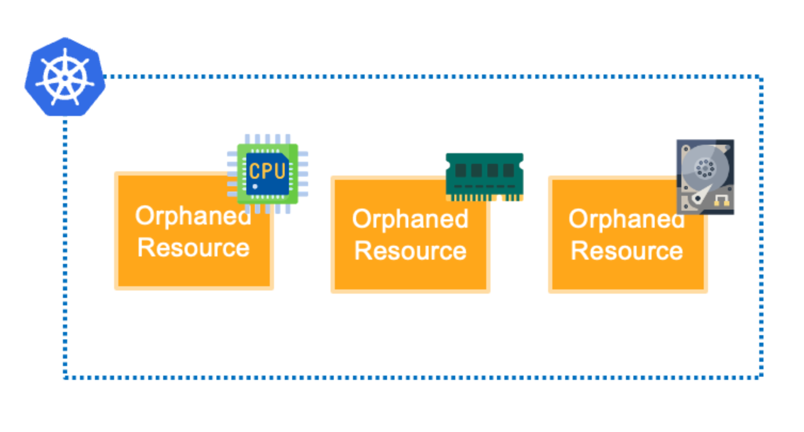
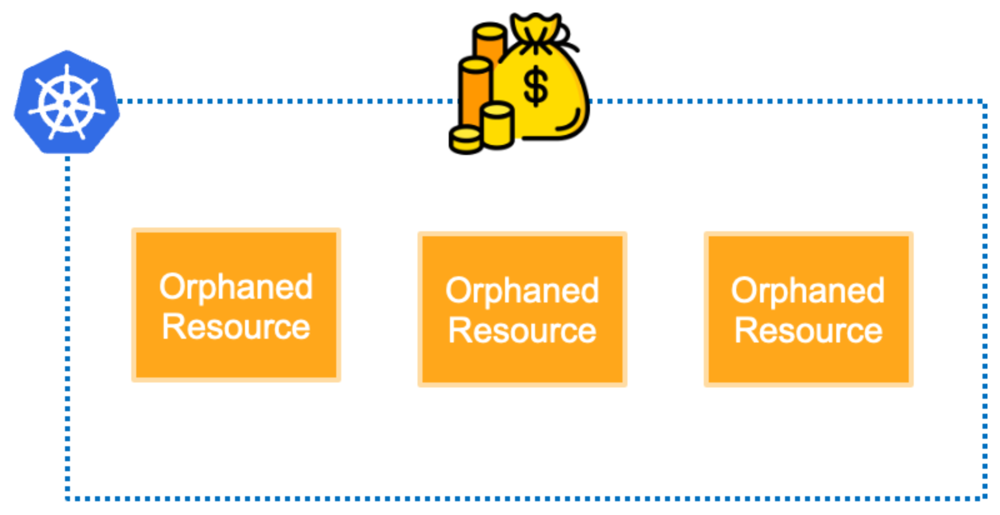
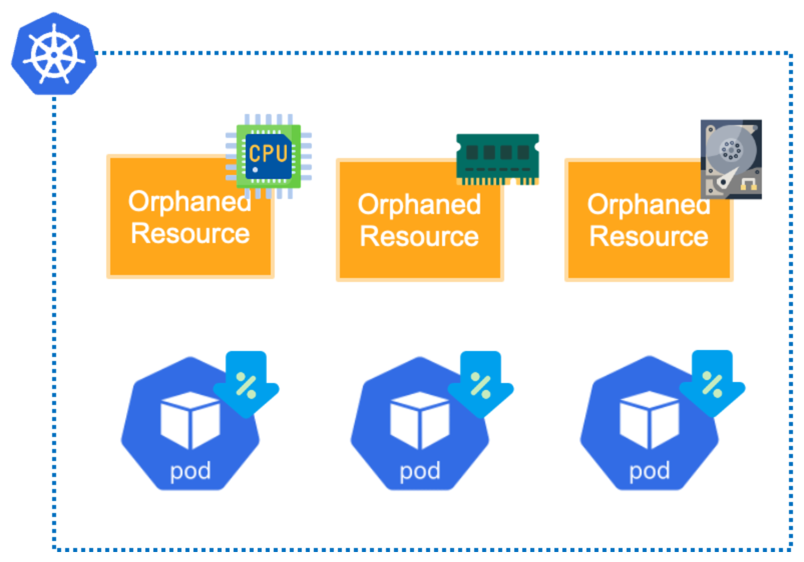

# CH20_02. 시나리오 설명 및 실습
> **주의사항**
이 실습에서는 ArgoCD의 `Orphaned Resource` 기능을 사용하여 불필요한 쿠버네티스 리소스를 관리하는 방법을 배웁니다.

<br>

## 챕터명

`Orphaned Resource` 관리하기

<br><br>

## 내용

`Orphaned Resource`는 ArgoCD가 관리하는 애플리케이션 구성에 포함되지 않는 쿠버네티스 리소스를 의미합니다. 
이러한 리소스는 클러스터에서 불필요한 리소스를 차지하고, 예상치 못한 동작을 유발할 수 있습니다.

<br>

이렇게 `Orphaned Resource`가 발생하는 이유는 다음과 같습니다:
1. 어떠한 이슈로 애플리케이션 구성에서 제거된 리소스가 클러스터에서 삭제되지 않은 경우
2. 애플리케이션 구성에 포함된 context에 외부 리소스가 포함된 경우
3. 누군가가 CLI로 애플리케이션이 관리하는 컨텍스트에 리소스를 생성했을 경우

<br>

`Orphaned Resource`를 모니터링하는 이유는 이러한 리소스가 클러스터에서 불필요한 리소스를 차지하고, 예상치 못한 동작을 유발할 수 있기 때문입니다. 예를 들어, 오래된 버전의 Deployment가 여전히 실행 중이거나, 더 이상 사용되지 않는 ConfigMap이 존재하는 경우 등입니다.

<br>

`Orphaned Resource`가 발생하면 다음과 같은 이슈들이 발생할 수 있습니다.


**[그림1. 쿠버네티스 클러스터에서 리소스를 낭비]**

쿠버네티스에서 `Orphaned Resource`는 클러스터 리소스의 낭비를 초래하는 주요 요인 중 하나입니다. 이는 `Orphaned Resource`가 여전히 클러스터의 CPU, 메모리, 스토리지 등의 리소스를 점유하고 있기 때문입니다. 이러한 리소스는 클러스터에서 가장 중요한 자원이며, 이들이 효율적으로 사용되지 않으면 클러스터의 전반적인 성능과 효율성에 부정적인 영향을 미칩니다.

<br>


**[그림2. 클러스터 운영 비용을 증가시킬 수 있음]**

쿠버네티스에서 Orphaned Resource는 클러스터 운영 비용을 증가시키는 또 다른 주요 요인입니다. 이는 Orphaned Resource가 클러스터의 리소스를 점유하고 있기 때문에, 이러한 리소스를 유지하기 위한 비용이 발생하기 때문입니다.

<br>


**[그림3. 쿠버네티스 클러스터의 성능을 저하시킬 수 있음]**

쿠버네티스에서 Orphaned Resource는 클러스터의 성능을 저하시키는 주요 요인 중 하나입니다. 이는 Orphaned Resource가 클러스터의 리소스를 점유하고 있기 때문에, 이러한 리소스를 유지하기 위한 비용이 발생하며, 이로 인해 클러스터의 전반적인 성능이 저하될 수 있습니다.

또한,이름이나 다른 식별자가 충돌하는 경우, 새로운 리소스의 생성이나 업데이트가 실패할 수 있습니다.

<br><br>

## 환경

- EKS v1.28
- Terraform CLI v1.6.6
- kubectl v1.28.4
- ArgoCD v2.11.3(👉 https://argo-cd.readthedocs.io/en/stable/getting_started/)
- ArgoCD CLI v2.8.6(👉 https://argo-cd.readthedocs.io/en/stable/cli_installation/)

<br><br>

## 시나리오

1. `Orphaned Resource`가 존재할 때, 리소스 생성이 안될 때
2. `Orphaned Resource`를 모니터링하고, 관리하는 방법

<br><br>

## 파일 설명
|파일명|설명|
|deployment.yaml|flask 웹 서버를 배포하는 Deployment 리소스|

<br><br>

## 주요명령어

```bash
terraform init                    # 테라폼 모듈 다운로드 및 초기화 작업 진행
terraform plan                    # 테라폼으로 파일에 명시된 리소스들을 프로비저닝 하기 전 확인단계
terraform apply                   # 테라폼으로 파일에 명시된 리소스들을 프로비저닝
terraform destroy                 # 테라폼으로 파일에 명시된 리소스들을 삭제함

kubectl config current-context    # 현재 나의 로컬환경에 연결되어 있는 클러스터 확인
kubectl apply -f {파일명}           # yaml 파일에 기재된 쿠버네티스 리소스들을 생성
kubectl delete -f {파일명}          # yaml 파일에 기재된 쿠버네티스 리소스들을 삭제

# ArgoCD 프로젝트 리스트 확인
argocd proj list                  

# ArgoCD 프로젝트 생성
argocd proj create {PROJECT_NAME} --dest '*,*' --src '*' --allow-cluster-resource '*/*' --orphaned-resources true --orphaned-resources-warn true --upsert

# ArgoCD 프로젝트 삭제
argocd proj delete {PROJECT_NAME}

# ArgoCD application 리스트 확인
argocd app list

# ArgoCD application 생성
argocd app create {APP_NAME} --repo {GIT_REPO} --path {PATH} --dest-server {DEST_SERVER} --dest-namespace {DEST_NAMESPACE} --project {PROJECT_NAME} --sync-policy auto --upsert

# ArgoCD application 상세정보 확인
argocd app get {APP_NAME}

# ArgoCD application 삭제
argocd app delete {APP_NAME}

# port-forward
kubectl port-forward {RESOURCE}/{RESOURCE_NAME} {LOCAL_PORT}:{REMOTE_PORT}
```

<br><br>

## 실제 실습 명령어

```bash
1. # 0. 실습 환경 구축
terraform -chdir=../ init
terraform -chdir=../ plan
terraform -chdir=../ apply --auto-approve

# 1. ArgoCD 설치
kubectl create namespace argocd
kubectl apply -n argocd -f https://raw.githubusercontent.com/argoproj/argo-cd/stable/manifests/install.yaml
kubectl port-forward svc/argocd-server -n argocd 8080:443
argocd admin initial-password -n argocd
argocd login localhost:8080

# 2. ArgoCD 프로젝트 생성
argocd proj create test --dest '*,*' --src '*' --allow-cluster-resource '*/*' --upsert
# argocd proj create test --dest '*,*' --src '*' --allow-cluster-resource '*/*' --orphaned-resources true --orphaned-resources-warn true --upsert
argocd proj list

# 3. ArgoCD 애플리케이션 생성
kubectl create namespace test
argocd app create test --repo https://github.com/Hulkong/fastcampus-devops-practice-examples-100.git --path '02-강의준비/07-senario' --dest-server https://kubernetes.default.svc --dest-namespace test --project test --upsert

# 4. Orphaned Resource 생성
kubectl apply -f - <<EOF
apiVersion: apps/v1
kind: Deployment
metadata:
  name: sample-new
  namespace: test
spec:
  replicas: 1
  selector:
    matchLabels:
      app: my-app
  template:
    metadata:
      labels:
        app: my-app
    spec:
      containers:
      - name: my-app
        image: nginx
EOF

# 5. 리소스 정리 
argocd app delete argocd/test
argocd proj delete test
kubectl delete -n argocd -f https://raw.githubusercontent.com/argoproj/argo-cd/stable/manifests/install.yaml
terraform -chdir=../ destroy --auto-approve
```

<br><br>

## 참고

- [Orphaned Resources Monitoring](https://argo-cd.readthedocs.io/en/stable/user-guide/orphaned-resources/#orphaned-resources-monitoring)
