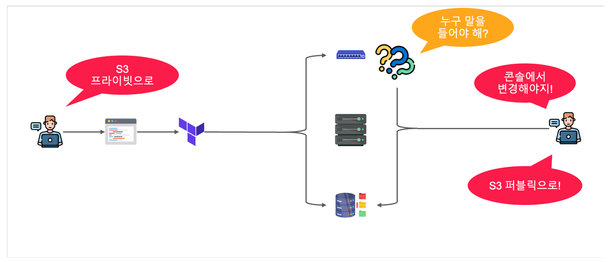
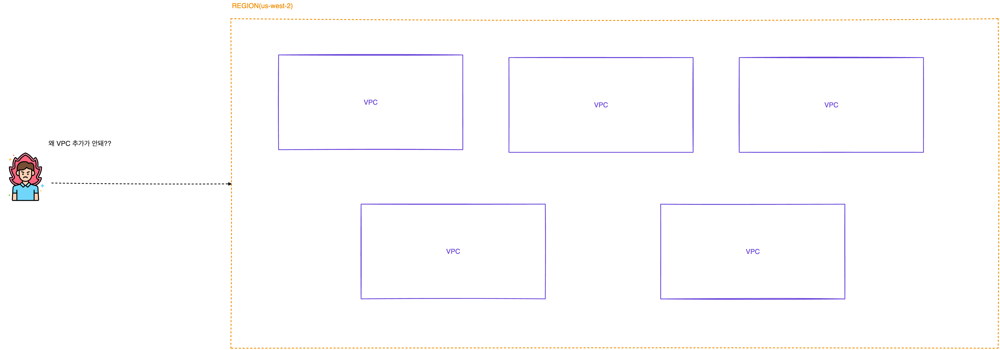
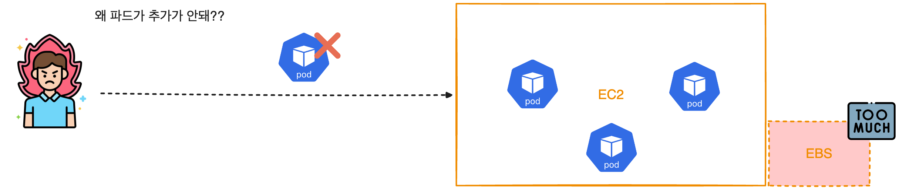
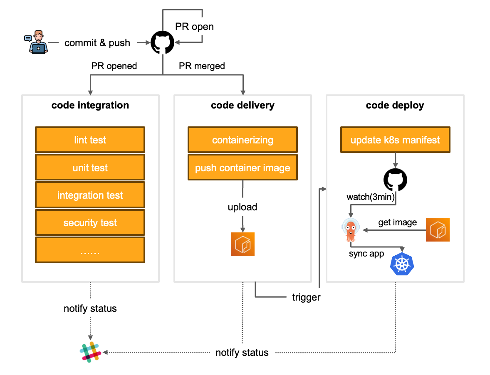
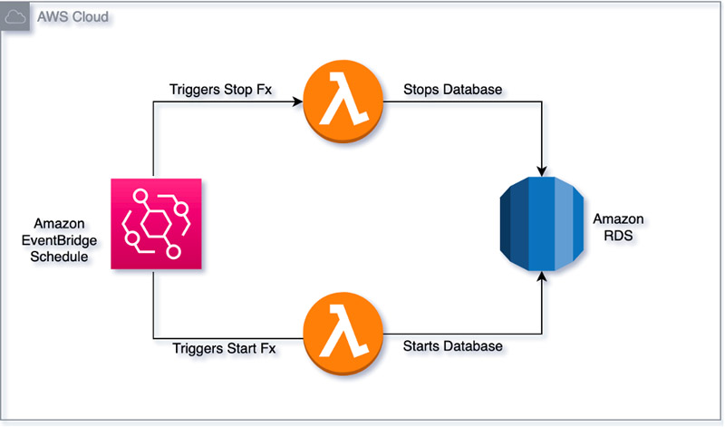
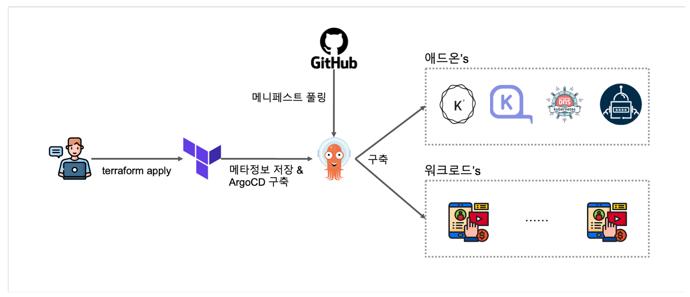
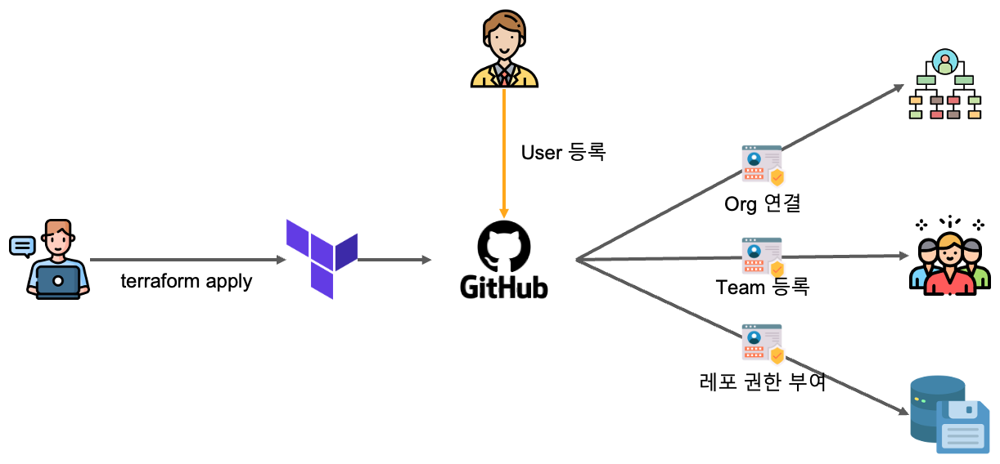
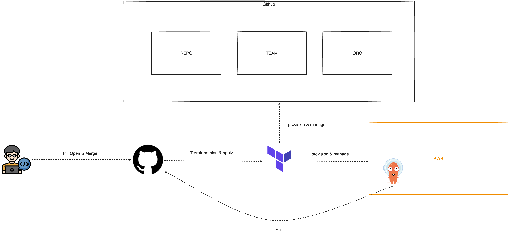

# 🚀 CH22_01. 사전준비
> **⚠️ 주의사항**
이 실습 강의를 진행하기 위해서는 다음과 같은 사전 준비가 필요합니다.
> - AWS 계정이 필요합니다.
> - Github Action을 사용하기 위해서는 Github 계정이 필요합니다.
> - Terraform을 사용하기 위해서는 Terraform CLI가 필요합니다.
> - EKS 클러스터를 생성합니다.
> - kubectl, k9s를 이용하여 쿠버네티스 클러스터를 관리합니다.

  

## 인프라 환경
실습에서 진행할 인프라 환경은 다음과 같습니다.

**1. 테라폼에서 발생하는 이슈를 해결해봅니다.**

 

**2. AWS 서비스 쿼타의 문제를 발생시키고, 해결해 본다.**

 

**3. 컨테이너를 운영 중인 인스턴스의 볼륨 용량 초과 이슈를 대응해 본다.**

 

**4. Github pr 프로세스를 적용하여 서비스의 완성도와 개발생산성을 높여본다.**

 

**5. 비용절감을 위하여 람다를 이용하여 유휴상태인 RDS 사용정지하는 시나리오를 진행해 본다.**

 

**6. gitops-bridge를 사용하여 한 큐에 EKS Best Practice를 적용한 인프라, 애드온, 서비스 구축해 본다.**

 

**7. github의 모든 리소스를 테라폼으로 관리**

 

**8. 효율적인 인프라 관리를 위해서 Git과 IaC를 이용하여 운영한다. 또한, 예외처리를 진행해본다.(실무미션)**

