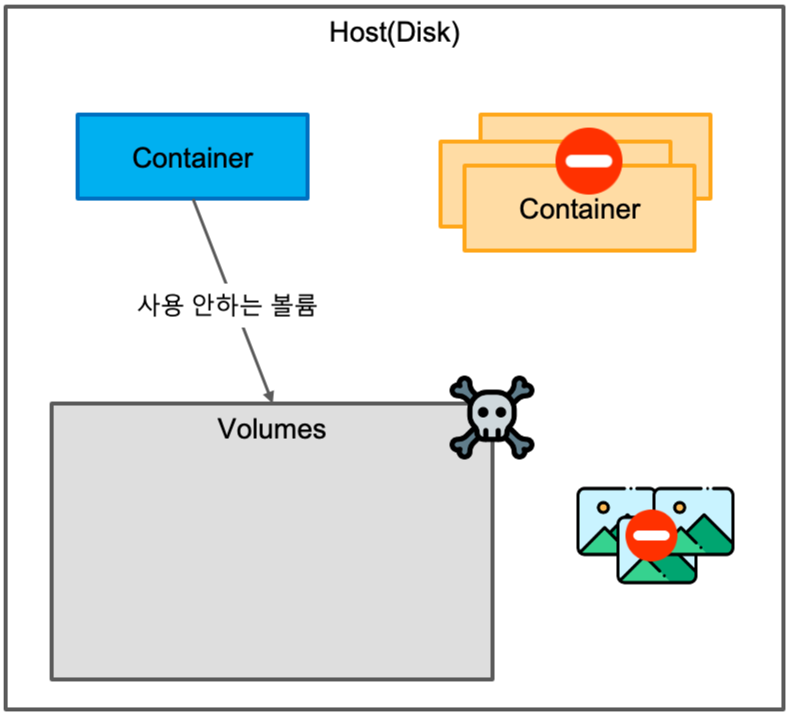
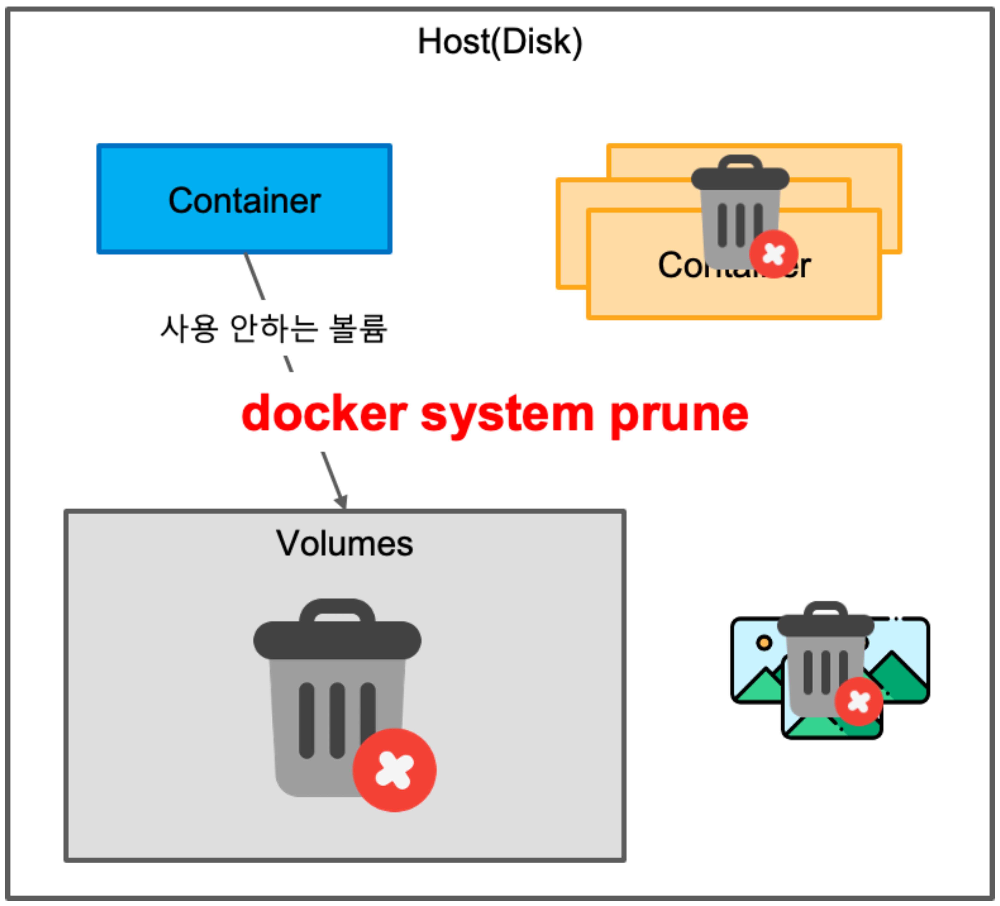

# CH26_03. 시나리오 설명 및 실습
> **주의사항**
이 실습에서는 EC2 인스턴스의 User Data가 초기 인스턴스 시작 시 한 번만 실행된다는 점을 유의하세요. 기존 인스턴스에서 User Data를 변경하더라도 자동으로 반영되지 않으므로, 인스턴스를 재생성하거나 스크립트를 수동으로 실행해야 합니다. 실습 후 반드시 모든 리소스를 정리하여 불필요한 비용이 발생하지 않도록 주의하세요.

<br>

## 챕터명

컨테이너 서비스를 운영하는 인스턴스의 EBS Volume 최적화

<br><br>

## 내용

이 강의에서는 컨테이너를 운영 중인 인스턴스에서 발생할 수 있는 볼륨 용량 초과 이슈를 어떻게 대응할 수 있는지 실습을 통해 배워봅니다. Docker 이미지를 반복적으로 생성하여 디스크 용량을 빠르게 채우고, 이를 모니터링하고 관리하는 방법을 알아봅니다. 또한, `logrotate`와 `docker system prune`을 사용하여 디스크 용량을 최적화하는 방법도 다룹니다.


**[그림1. 이미지 및 컨테이너 잔여물]**

<br>


**[그림2. 이미지 및 컨테이너 정리]**

<br><br>

## 환경

- AWS 계정
- Terraform 설치 및 구성
- IAM 권한: EC2, VPC, IAM, S3 접근 권한
- 기본적인 Terraform 구성 파일

<br><br>

## 시나리오

1. Terraform을 사용하여 Amazon Linux 2를 사용하는 EC2 인스턴스를 생성합니다.
2. User Data를 통해 Docker를 설치하고, 큰 파일을 생성하는 Docker 이미지를 빌드합니다.
3. Docker 이미지를 반복적으로 빌드하여 디스크 용량을 채웁니다.
4. 디스크 사용량을 모니터링하여 변화를 확인합니다.
5. `logrotate`와 `docker system prune`을 사용하여 불필요한 파일과 이미지를 정리합니다.

<br><br>

## 파일 설명
|파일명|설명|
|---|---|
|main.tf|Terraform 메인 구성 파일로, VPC, 서브넷, 보안 그룹, EC2 인스턴스를 생성하는 코드 포함|
|userdata.sh|EC2 인스턴스의 User Data 스크립트로, Docker 설치 및 큰 파일 생성하는 이미지 빌드 스크립트 포함|

<br><br>

## 주요명령어

```bash
# Terraform 주요 명령어
terraform init
terraform plan
terraform apply
terraform destroy
```

<br><br>

## 실제 실습 명령어

```bash
# 0. 실습 환경 구축
terraform -chdir=../ init
terraform -chdir=../ plan
terraform -chdir=../ apply --auto-approve

# 1. 컨테이너 서비스 운영 인스턴스의 EBS Volume 최적화 실습
terraform init
terraform apply --auto-approve

# 2. 실습환경 삭제
terraform destroy --auto-approve
```
