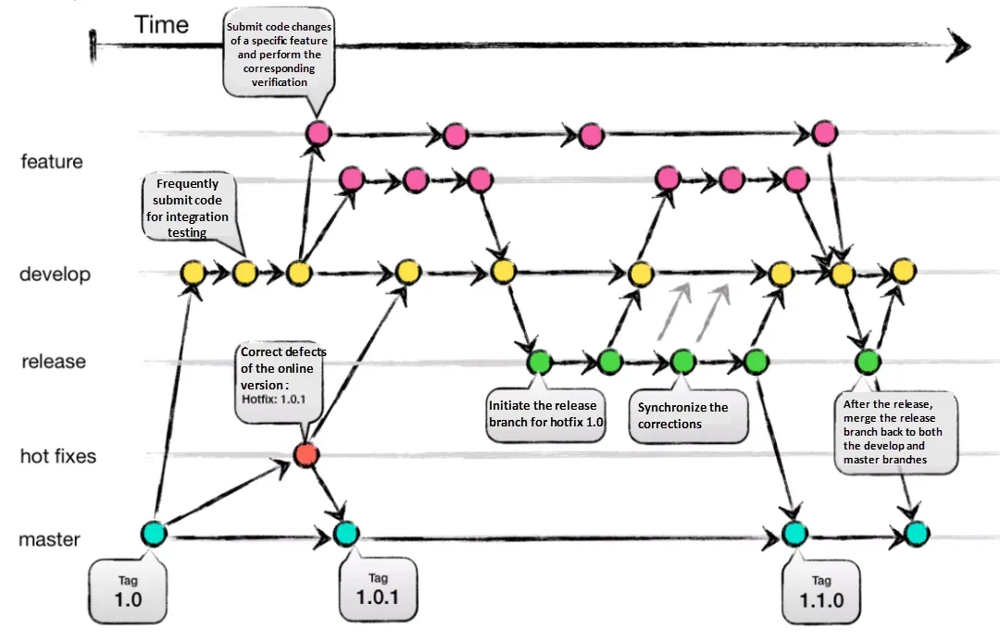
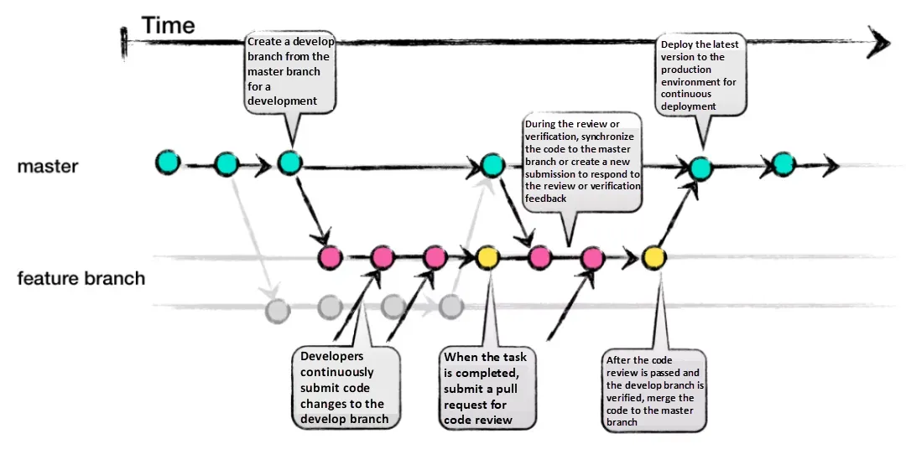
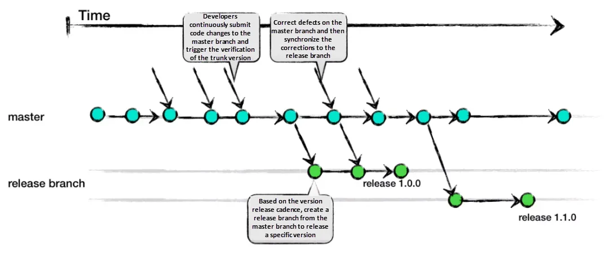

# CH27_03. 시나리오 설명 및 실습
> **주의사항**
> - 이 문서는 시나리오 설명 및 실습을 위한 가이드 문서입니다. 
> - 실습을 진행할 때, 본인의 Github 계정을 사용하고, 저장소를 생성합니다.

 

## 챕터명

안정적이고 개발생산성을 높이기 위한 Github repo, branch, PR 정책 수립

  

## 환경

사전 요구 사항

- Github 계정
- Git 설치 및 구성
- 협업을 위한 팀원 초대 (optional)

  

## 시나리오

#### 1. Github 저장소 생성

#### 2. 필수 파일 추가
- README.md 파일을 추가하여 프로젝트 설명을 작성합니다.
- .gitignore 파일을 추가하여 불필요한 파일을 제외합니다.
- LICENSE 파일을 추가하여 프로젝트의 라이선스를 지정합니다.

 

#### 3. 브랜치 전략 수립
- Git Flow

**[그림1. Git flow]**

 

- Github Flow

**[그림2. Github flow]**

 

- Trunk Based Development

**[그림2. Trunk Based Development]**

 

#### 4. Pull Request (PR) 정책 수립

- PR 템플릿 작성
- 코드 리뷰 규칙
- 자동화 도구 통합(Github Action)
- Merge 전략

  

## 파일 설명
|파일명|설명|
|---|---|
|내용을 입력해주세요.|내용을 입력해주세요.|

  

## 참고

- [Choosing the Right Git Branching Strategy: A Comparative Analysis](https://medium.com/@sreekanth.thummala/choosing-the-right-git-branching-strategy-a-comparative-analysis-f5e635443423#:~:text=Git%2DFlow%20suits%20large%20teams,on%20collaboration%20and%20quick%20releases.)
- [GitHub Flow](https://docs.github.com/en/get-started/using-github/github-flow)
- [Trunk-Based Development](https://trunkbaseddevelopment.com/)