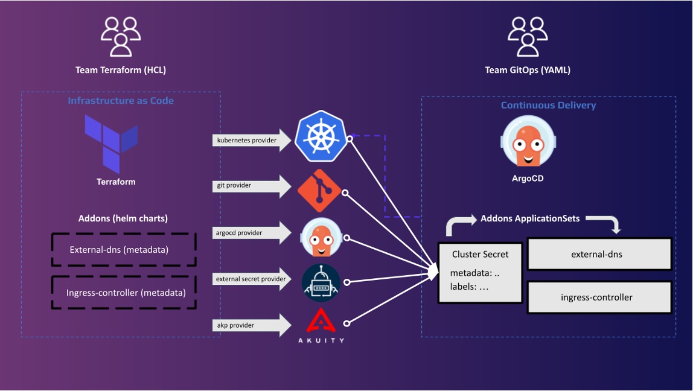
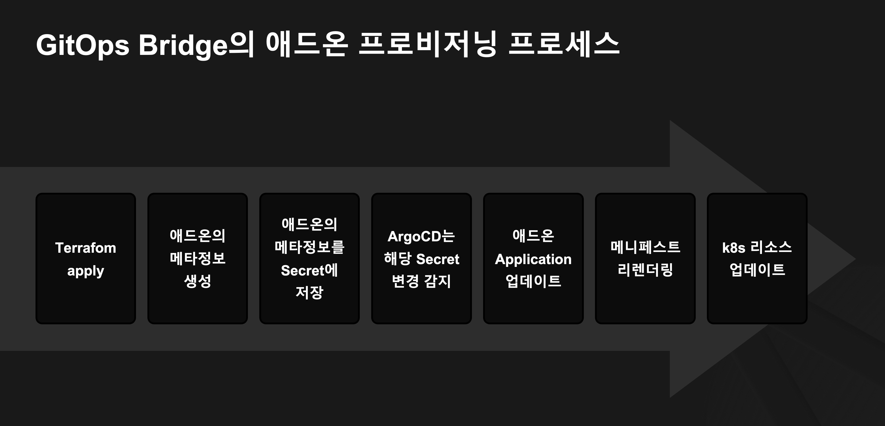
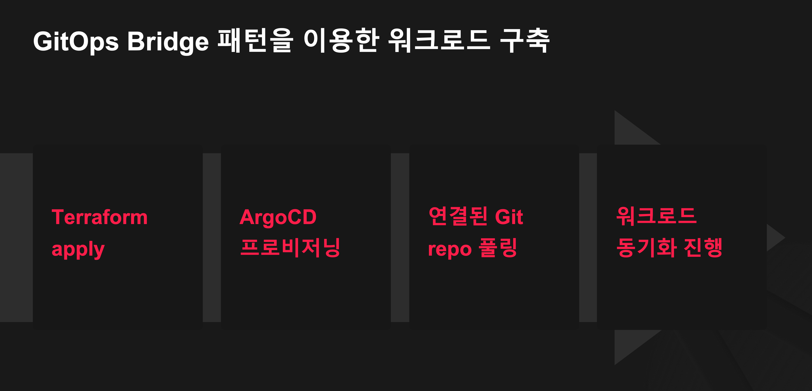

# CH29_03. 시나리오 설명 및 실습
> **주의사항1**
실습을 진행하기 전에 AWS 계정 및 필요한 권한이 있는지 확인하세요. 모든 명령어와 파일 경로가 정확히 설정되었는지 확인하고, 필요한 도구가 설치되어 있는지 확인합니다.

> **주의사항2**
terraform으로 프로비저닝된 리소스 및 서비스들은 시나리오 종료시마다 반드시 `terraform destroy` 명령어를 사용하여 정리해주세요. 그렇지 않으면, 불필요한 비용이 많이 발생할 수 있습니다. AWS 비용 측정은 시간당으로 계산되기에 매번 리소스를 생성하고 삭제하는 것이 불편하실 수도 있겠지만, 비용을 절감시키기 위해서 권장드립니다. 본인의 상황에 맞게 진행해주세요.

> **주의사항3**
실습 정리할 때, AWS ALB와 TargetGroup, Route53 record은 Terraform에서 상태관리 되지 않기 때문에 수동으로 삭제해야 합니다.
> - AWS Application Load Balancer Controller를 사용하여 ALB를 생성하였을 경우, ALB와 TargetGroup을 수동으로 삭제해야 합니다.
> - ExternalDNS를 사용하여 Route53 record를 생성하였을 경우, Route53 record를 수동으로 삭제해야 합니다.

<br>

## 챕터명

gitops-bridge를 사용하여 한 큐에 EKS Best Practice를 적용한 인프라, 애드온, 서비스 구축

<br><br>

## 내용

이 실습에서는 Terraform을 사용하여 AWS 인프라(VPC, EKS 클러스터 및 기본적인 EKS 애드온)를 생성하고, ArgoCD를 통해 GitOps 방식으로 애드온 및 애플리케이션을 배포하는 방법을 다룹니다. GitOps 브릿지 역할을 하는 ArgoCD Secret을 생성하여 GitOps repo와 연결하고, 이를 통해 효율적으로 EKS Best Practice를 적용합니다.


**[그림1. GitOps Bridge 패턴]**

<br>


**[그림2. GitOps Bridge 패턴을 적용한 워크플로우]**

<br>


**[그림3. GitOps Bridge 패턴을 이용한 애드온 프로비저닝 프로세스]**

<br>


**[그림4. GitOps Bridge 패턴을 이용한 워크로드 프로비저닝 프로세스]**

<br><br>

## 환경

- AWS 계정
- Terraform Cli v1.6.3
- kubectl v1.28.4
- k9s v0.28.2
- aws CLI v2.15.17
- EKS v1.28
- ArgoCD 설치

<br><br>

## 시나리오

1. Terraform을 사용하여 VPC, EKS 클러스터 및 기본적인 EKS 애드온을 포함한 AWS 인프라를 생성합니다.
2. GitOps 브릿지 역할을 하는 ArgoCD Secret을 생성하고, ArgoCD를 프로비저닝합니다.
3. ArgoCD는 Secret에 명시된 내용을 기반으로 GitOps repo와 연결하여, GitOps repo에 명시된 애드온 및 애플리케이션을 배포합니다.

<br><br>

## 파일 설명
|파일명|설명|
|---|---|
|aws/*|Terraform을 사용하여 AWS 인프라를 생성하는 코드|
|gitops/*|GitOps repo에 배포할 애드온 및 애플리케이션 코드|

<br><br>

## 실제 실습 명령어

```bash
# 0. 실습 환경 구축
terraform -chdir=aws init
terraform -chdir=aws plan
terraform -chdir=aws apply --auto-approve

# 2. 실습환경 삭제
# 실습 정리할 때, AWS ALB와 TargetGroup, Route53 record은 Terraform에서 상태관리 되지 않기 때문에 수동으로 삭제해야 합니다.
terraform -chdir=aws state rm 'module.argocd[0].argocd_project.administration' &&\
terraform -chdir=aws state rm 'module.argocd[0].argocd_project.workload' &&\
terraform -chdir=aws state rm 'module.argocd[0].argocd_application.bootstrap_workloads' &&\
terraform -chdir=aws state rm 'module.argocd[0].argocd_application.bootstrap_addons' &&\
terraform -chdir=aws state rm 'kubernetes_namespace.argocd' &&\
terraform -chdir=aws state rm 'kubectl_manifest.karpenter_default_ec2_node_class' &&\
terraform -chdir=aws state rm 'kubectl_manifest.karpenter_default_node_pool' &&\
terraform -chdir=aws state rm 'module.eks.kubernetes_config_map_v1_data.aws_auth' 
terraform -chdir=aws state rm 'kubernetes_secret.git_repo_credential_templates' &&\
terraform -chdir=aws state rm 'kubernetes_secret.argocd_vault_plugin_credentials' &&\
terraform -chdir=aws state rm 'module.gitops_bridge_bootstrap.helm_release.argocd[0]' &&\
terraform -chdir=aws state rm 'module.gitops_bridge_bootstrap.kubernetes_secret_v1.cluster[0]' &&\
terraform -chdir=aws destroy --auto-approve
```

<br><br>

## 참고

- [gitops-bridge](https://github.com/gitops-bridge-dev/gitops-bridge)
- [gitops-bridge-argocd-control-plane-template](https://github.com/gitops-bridge-dev/gitops-bridge-argocd-control-plane-template)
- [GitOps Bridge 패턴 예제코드](https://github.com/Hulkong/fastcampus-devops-practice-examples-100-gitops)
- [Protect sensitive input variables](https://developer.hashicorp.com/terraform/tutorials/configuration-language/sensitive-variables)
- [Github Personal Access Token](https://docs.github.com/ko/authentication/keeping-your-account-and-data-secure/managing-your-personal-access-tokens)
