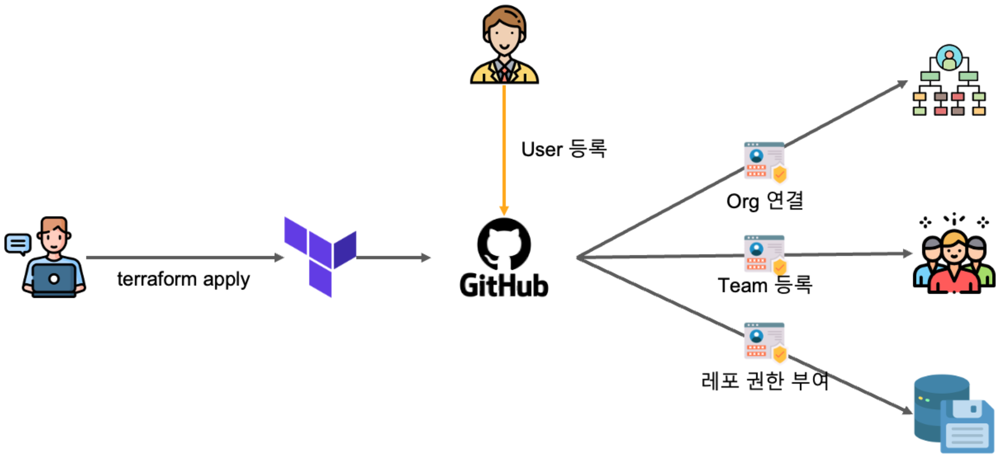

# CH30_02. 시나리오 설명 및 실습
> **주의사항**
terraform으로 프로비저닝된 리소스 및 서비스들은 시나리오 종료시마다 반드시 `terraform destroy` 명령어를 사용하여 정리해주세요. 그렇지 않으면, 불필요한 비용이 많이 발생할 수 있습니다. AWS 비용 측정은 시간당으로 계산되기에 매번 리소스를 생성하고 삭제하는 것이 불편하실 수도 있겠지만, 비용을 절감시키기 위해서 권장드립니다. 본인의 상황에 맞게 진행해주세요.
> - 이 실습은 Terraform의 기본적인 사용법을 알고 있는 사용자를 대상으로 합니다.

<br>

## 챕터명

Github의 모든 리소스를 테라폼으로 관리

<br><br>

## 내용

이 강의에서는 Github의 모든 리소스를 Terraform을 사용하여 관리하는 방법을 배웁니다. 이를 통해 리소스 관리의 자동화와 효율성을 높일 수 있습니다.


**[그림1. Terraform을 이용하여 Github의 리소스를 관리하는 모습]**

<br><br>

## 환경

- Terraform CLI v1.6.6
- Github 계정

<br><br>

## 시나리오

- Terraform으로 Github User 생성 및 관리
- Terraform으로 Github Team 생성 및 관리
- Terraform으로 Github Repository 생성 및 관리

1. 새로운 팀(devops)이 생성되었을 때
2. 새로운 레포지토리(test-repository-02)가 생성되었을 때
3. devops에서 관리하는 레포를 연결하는 시나리오
4. devops 팀원이 들어왔을 때, 자동으로 권한을 부여하는 시나리오

<br><br>

## 파일 설명
|파일명|설명|
|---|---|
|locals.tf|Terraform 로컬 변수 설정|
|organization.tf|Terraform으로 Github Organization 생성 및 관리|
|output.tf|Terraform 출력 변수 설정|
|provider.tf|Terraform 공급자 설정|
|repository.tf|Terraform으로 Github Repository 생성 및 관리|
|teams.tf|Terraform으로 Github Team 생성 및 관리|
|users.tf|Terraform으로 Github User 생성 및 관리|

<br><br>

## 주요명령어

```bash
terraform init
terraform apply
```

<br><br>

## 실제 실습 명령어
  
```bash
# 실습 시작 전 Terraform 초기화
cd 03-강의준비/08-senario
terraform init
export GITHUB_TOKEN=YOUR_GITHUB_TOKEN
terraform apply --auto-approve


# 실습 종료 후 리소스 정리
terraform state rm 'module.organization.github_membership.membership["hulkong"]' \
  'module.organization.github_team_membership.all["hulkong"]' \
  'module.team_admin.github_team_membership.team_membership["hulkong"]'
terraform destroy --auto-approve
```

<br><br>

## 파일 설명

